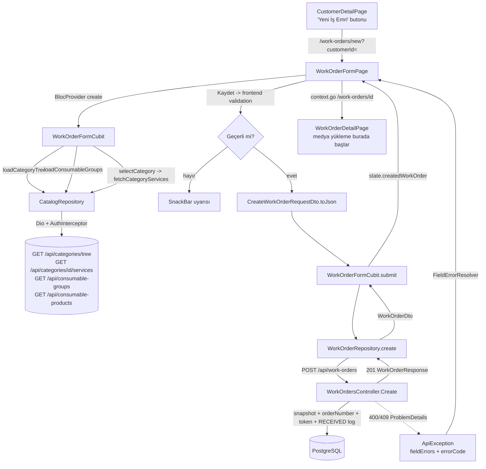
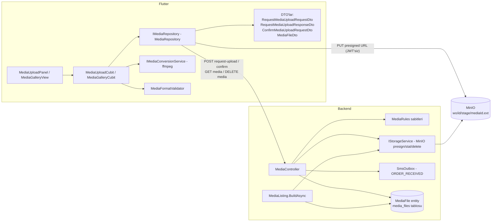

# Product Create & Product Detail — Derin Teknik Analiz

> **Analiz tarihi:** 30 Temmuz 2026
> **Kapsam:** Yalnızca Product Create ve Product Detail modülleri (+ bunların ayrılmaz parçası olan medya/upload alt sistemi).
> **Yöntem:** Salt okunur kod analizi. Bu dokümandaki her tespit dosya/sınıf/endpoint/DTO referansı ile doğrulanmıştır; koddan doğrulanamayan hiçbir bilgi gerçekmiş gibi yazılmamıştır.

## 0. Terminoloji ve Kaynak Eşlemesi

Bu projede **"Product" (ürün) kavramının kod karşılığı `WorkOrder` (iş emri)** modülüdür. Müşterinin atölyeye bıraktığı deri ürün, bir iş emri kaydı olarak yaşar:

| İstenen kavram | Koddaki karşılığı |
|---|---|
| Product Create | `WorkOrderFormPage` + `WorkOrderFormCubit` (`lib/features/work_order/`) |
| Product Detail | `WorkOrderDetailPage` (masaüstü) + `MobileWorkOrderDetailPage` (mobil kabuk) |
| Product API | `WorkOrdersController` (`AtolyeProjesi/src/LeatherCare.Web/Controllers/WorkOrdersController.cs`) |
| Media API | `MediaController` (`.../Controllers/MediaController.cs`) |

Kullanılan kaynaklar ve gerçek konumları:

| İstenen kaynak | Gerçek konum |
|---|---|
| Mevcut Flutter Projesi | `/Users/semih/AtolyeProje/atolye_flutter` |
| Backend Repository (salt okunur) | `/Users/semih/AtolyeProje/AtolyeProjesi` (`LeatherCare.Web`, ASP.NET Core 8) |
| Swagger JSON | Repo'da commit'li `swagger.json` **yok**; Swagger yalnızca çalışma zamanında üretilir (`Program.cs` ~144–171 `AddSwaggerGen`, ~220–226 `UseSwagger` — Development veya `Swagger:Enabled=true`). Flutter reposunda OpenAPI 3.0.1 dökümü mevcut: `atolye_flutter/swagger_json` (uzantısız dosya). |
| Solution Design Document | `atolye_flutter/docs/solution-design-document.md` (F1–F7; F4 fiş/barkod, F5 mobil kabuk + tarayıcı, F6 mobil detay) |
| Analysis Document | `atolye_flutter/docs/teknik-analiz-ve-gelistirme-plani.md` + backend `AtolyeProjesi/doc/spec.md` (Faz 1 spesifikasyonu) |

Önemli terminoloji notu: Talepte geçen bazı alanlar (**ürün adı, seri no, IMEI, model, cihaz türü**) bu sistemde **mevcut değildir** — bu bir telefon servis sistemi değil, deri ürün bakım/onarım sistemidir. "Cihaz türü"nün karşılığı 3 seviyeli **kategori ağacının level-3 düğümü** (ürün türü), "model"in en yakın karşılığı serbest metin **`brand`** alanıdır. Bu eşleme Bölüm 1'de alan alan gösterilmiştir.

---

# 1. Product Create Analizi

## 1.1 Ekrana Giriş Akışı

Ürün oluşturma **müşteri-öncelikli** bir akıştır; formda müşteri seçici yoktur:

1. `CustomerSearchPage` (`/customers`) → müşteri aranır (telefon/ad).
2. `CustomerDetailPage` → **"Yeni İş Emri"** butonu → `/work-orders/new?customerId={id}` (`customer_detail_page.dart` ~101–105).
3. `app_router.dart` (~75–82) `customerId` query parametresini `WorkOrderFormPage(customerId: ...)` olarak enjekte eder.
4. Form `submit` sırasında `widget.customerId!` kullanır (`work_order_form_page.dart` ~395) — **customerId formun ön koşuludur**, form içinde değiştirilemez.

Aynı sayfa **düzenleme modunda** da kullanılır: `WorkOrderDetailPage` → "Düzenle" → `WorkOrderFormPage(existingWorkOrder: workOrder)` (`work_order_detail_page.dart` ~492–505). Düzenlemede kategori salt okunur gösterilir (~454–458).

> Mobil kabukta (`lib/app/mobile/mobile_router.dart`) **ürün oluşturma rotası yoktur** — form yalnızca masaüstü router'ında tanımlıdır.

## 1.2 Kullanılan Endpointler

Formun fiilen çağırdığı uçlar (tamamı `lib/core/constants/api_endpoints.dart` üzerinden, JWT zorunlu):

### 1.2.1 Kategori (= "cihaz/ürün türü")

| | |
|---|---|
| HTTP / URL | `GET /api/categories/tree?includeInactive=false` |
| Çağıran | `WorkOrderFormCubit.loadCategoryTree()` → `CatalogRepository.fetchCategoryTree()` |
| Request | Yok (query: `includeInactive`, formda daima `false`) |
| Response DTO | `List<CategoryTreeDto>` — `id`, `name`, `level`, `isActive`, `children` (Flutter: `category_tree_dto.dart`; backend: `CategoryTreeResponse`, `CategoriesController.cs`) |
| Validation | Backend'de yok (listeme ucu). Formda ağaç `_flattenLevel3()` ile **yalnızca level-3** düğümlere indirgenir (`work_order_form_page.dart` ~29–43). |

### 1.2.2 Hizmetler + Fiyatlar (tek uçta birleşik)

| | |
|---|---|
| HTTP / URL | `GET /api/categories/{categoryId}/services` |
| Çağıran | `WorkOrderFormCubit.selectCategory()` → `CatalogRepository.fetchCategoryServices()` — kategori her değiştiğinde |
| Response DTO | `CategoryServicesDto` — `categoryId`, `categoryPath`, `services: List<ServicePriceOptionDto>` (`servicePriceId`, `serviceName`, `price`) |
| Backend | `CategoriesController.GetServices` — **404** `CATEGORY_NOT_FOUND`, **400** `INVALID_CATEGORY_LEVEL` |
| Not | Ayrı bir "fiyat endpoint'i" bu ekranda çağrılmaz; fiyat, hizmet seçeneğinin içinde gelir. (`GET /api/service-prices` yalnızca katalog yönetim ekranında kullanılır.) |

### 1.2.3 Sarf Ürünleri

| | |
|---|---|
| HTTP / URL | `GET /api/consumable-groups` ve `GET /api/consumable-products?groupId={id}` |
| Çağıran | `loadConsumableGroups()` (form açılışında) ve `loadConsumableProducts(groupId:)` ("Ekle" butonuna basılınca, seçili grup filtresiyle) |
| Response DTO | `ConsumableGroupDto` (`id`, `name`, `isActive`); `ConsumableProductDto` (`id`, `groupId`, `groupName`, `brand?`, `name`, `displayName`, `salePrice`, `isActive`) |
| Validation | Backend'de listeleme için yok. |

### 1.2.4 Ürün Oluşturma

| | |
|---|---|
| HTTP / URL | `POST /api/work-orders` |
| Çağıran | `WorkOrderFormCubit.submit()` → `WorkOrderRepository.create()` |
| Request DTO | `CreateWorkOrderRequestDto` (Flutter) ↔ `CreateWorkOrderRequest` (backend): `customerId`, `categoryId`, `brand?`, `color?`, `material?`, `description?`, `existingDamages?`, `estimatedDeliveryDate?` (date-only JSON, `date_only_json.dart`), `servicePriceIds: List<int>`, `consumables: List<ConsumableLineDto>` (`consumableProductId`, `quantity`), `price`, `hasPrepayment`, `prepaymentAmount?` |
| Response DTO | `WorkOrderDto` ↔ `WorkOrderResponse` (tam alan listesi Bölüm 2.2.1'de) — **201 Created** |
| Validation (FluentValidation, `CreateWorkOrderRequestValidator`, `WorkOrdersController.cs` ~113–137) | `customerId > 0`; `categoryId > 0`; `price ≥ 0`; `servicePriceIds` NotNull; `consumables` NotNull; her satırda `quantity ≥ 1`; `hasPrepayment=true` ⇒ `prepaymentAmount` zorunlu, `0 ≤ prepaymentAmount ≤ price`; `hasPrepayment=false` ⇒ `prepaymentAmount` **null olmalı** |
| Runtime iş kuralı hataları (400) | `CUSTOMER_NOT_FOUND`, `INVALID_CATALOG_ITEM` (kategori/hizmet/sarf yok ya da pasif), `INVALID_CATEGORY_LEVEL` (level ≠ 3), `SERVICE_CATEGORY_MISMATCH` (hizmet fiyatı başka kategoriye ait) |

### 1.2.5 Müşteri

Form müşteri ucu **çağırmaz**; `customerId` route'tan gelir. Müşteri uçları (`CustomersController`, form akışının öncülü): `POST /api/customers`, `GET /api/customers?search=`, `GET/PUT /api/customers/{id}`, İYS uçları. Backend `Create` içinde müşteri varlığı ayrıca doğrulanır (`CUSTOMER_NOT_FOUND`).

### 1.2.6 Talepte geçen ama bu ekranda VAR OLMAYAN uçlar

| İstenen | Durum (kod kanıtı) |
|---|---|
| Marka endpoint'i | **Yok.** `brand` serbest metin `TextField` (`work_order_form_page.dart` ~598–604). Marka master tablosu yalnızca sarf ürünlerinde (`ConsumableProductDto.brand`) vardır. |
| Model endpoint'i | **Yok.** Sistemde "model" varlığı bulunmuyor. |
| Cihaz türleri endpoint'i | Ayrı uç yok; karşılığı kategori ağacının level-3'ü (1.2.1). |
| Medya / upload | Create ekranında **çağrılmaz** — medya yükleme yalnızca detay ekranındadır (Bölüm 3'te ispat). |
| Barcode endpoint'i | **Yok.** Backend kaynak kodunda `barcode/receipt/print/qr` araması sıfır sonuç döner. Barkod içeriği = `orderNumber`, sunucu tarafında otomatik üretilir (1.4). |

## 1.3 Form Yapısı — Alan Alan

Kaynak: `work_order_form_page.dart` (state alanları ~109–125, submit ~319–425).

| Alan | UI bileşeni | Zorunlu? | Frontend validation | Backend validation | Varsayılan | API mapping |
|---|---|---|---|---|---|---|
| Müşteri | Yok (route parametresi) | **Evet** | Yok (form `customerId!` varsayar) | `customerId > 0`; `CUSTOMER_NOT_FOUND` | — | `customerId` |
| Ürün türü (kategori) | `DropdownButton<int>` — level-3 yolları "Çanta > Deri > El Çantası" formatında | **Evet** | `_selectedCategoryId == null` ⇒ SnackBar "Lütfen bir ürün türü seçin.", istek atılmaz (~320–325) | `categoryId > 0`; level=3 (`INVALID_CATEGORY_LEVEL`); kendisi ve tüm ataları aktif (`INVALID_CATALOG_ITEM`) | Boş | `categoryId` |
| Hizmetler | `FilterChip` listesi ("Ad — ₺fiyat") | Hayır (boş liste = "tarifesiz iş") | Yok | Liste NotNull; her id var + aktif + **seçilen kategoriye ait** (`SERVICE_CATEGORY_MISMATCH`); duplicate id'ler `Distinct()` ile teklenir | `[]` | `servicePriceIds` |
| Sarf malzemeler | "Ekle" butonu → `AlertDialog` (ürün dropdown + adet +/-) + grup filtresi dropdown'ı | Hayır | Dialog `quantity ≥ 1`'i buton disable ile garanti eder | Liste NotNull; `quantity ≥ 1`; ürün var + aktif; aynı ürün birden çok satırda gelirse **adetler backend'de birleştirilir** (`BuildConsumableSnapshotsAsync` ~564–567) | `[]` | `consumables[{consumableProductId, quantity}]` |
| Marka | `TextField` | Hayır | Yok (maxLength yok); boş string → `null`'a çevrilir | FluentValidation'da kural yok; DB kolonu **100 karakter** (`AppDbContext.cs`) | boş | `brand` |
| Renk | `TextField` | Hayır | Yok; boş → null | DB kolonu **50 karakter** | boş | `color` |
| Malzeme | `TextField` | Hayır | Yok; boş → null | DB kolonu **100 karakter** | boş | `material` |
| Açıklama | `TextField` (maxLines: 2) | Hayır | Yok; boş → null | FluentValidation/uzunluk kuralı yok | boş | `description` |
| Mevcut Hasarlar (= "arıza/detay") | `TextField` (maxLines: 2) | Hayır | Yok; boş → null | Kural yok | boş | `existingDamages` |
| Tahmini teslim tarihi | Metin + "Tarih Seç" → `showDatePicker` | Hayır | Picker aralığı: `firstDate: DateTime.now()`, `lastDate: +365 gün` (~209–215) | **Backend'de hiçbir tarih kuralı yok** (geçmiş tarih API'den kabul edilir) | null ("seçilmedi") | `estimatedDeliveryDate` (yyyy-MM-dd) |
| Nihai fiyat | `TextField` (decimal klavye) | **Evet** | `double.tryParse(text.replaceAll(',', '.'))`; null veya `< 0` ⇒ SnackBar "Geçerli bir fiyat girin." (~327–333). 0 girilirse uyarı etiketi: "garanti/jest işi olarak kaydedilecek" (~694–700) | `price ≥ 0`; sunucuda `Money.Round` (2 hane, AwayFromZero) | `'0.00'`; hizmet/sarf seçimiyle **otomatik önerilen toplama senkronlanır**, kullanıcı elle değiştirene dek (`_priceManuallyEdited`, ~201–207) | `price` |
| Önerilen fiyat (bilgi) | Salt okunur `Text` | — | İstemci tarafı ön izleme: `Σ hizmet + Σ (adet × sarf birim)` (~193–199) | Bağlayıcı değer sunucuda hesaplanır (`PricingService`) ve response'ta `suggestedPrice` döner; **istekte gönderilmez** | 0.00 | — |
| Ön ödeme alındı | `SwitchListTile` | Hayır | — | — | `false` | `hasPrepayment` |
| Ön ödeme tutarı | `TextField` (yalnızca switch açıkken görünür) | Switch açıksa **evet** | null / `< 0` / `> price` ⇒ SnackBar "Ön ödeme tutarı 0 ile nihai fiyat arasında olmalıdır." (~335–351) | `hasPrepayment=true` ⇒ NotNull + `0 ≤ x ≤ price`; `false` ⇒ **Null olmalı** (istemci bunu `_hasPrepayment ? prepaymentAmount : null` ile garanti eder, ~417) | boş | `prepaymentAmount` |
| Durum | **Formda yok** | — | — | Sunucu `RECEIVED` atar (1.4) | `RECEIVED` | — |
| Ürün adı / seri no / IMEI / model | **Sistemde yok** | — | — | — | — | — |

Sunucu alan hataları `ApiException.fieldErrors` → `FieldErrorResolver` (`lib/core/network/field_error_resolver.dart`) ile ilgili alanın `errorText`'ine bağlanır (`brand`, `color`, `material`, `description`, `existingDamages`, `estimatedDeliveryDate`, `price`, `prepaymentAmount` için tek tek bağlı, ~602–714). Genel hata mesajı kırmızı kutuda gösterilir (~720–734).

## 1.4 Business Logic (kod üzerinden, oluşturma anında)

Tamamı `WorkOrdersController.Create` (~173–223) ve yardımcılarında:

1. **Otomatik sipariş numarası (= barkod içeriği):** `NextOrderNumberAsync` (~594–599): `WO-{UTCyıl}-{nextval('work_order_seq'):D6}` → örn. `WO-2026-000123`. Global PostgreSQL sequence'ı; **yıl başında sıfırlanmaz**. İstemci göndermez, üretemez.
2. **Takip token'ı:** `TrackingToken.Generate()` — 32 rastgele bayt → Base64Url (43 karakter). UNIQUE çakışmasında bir kez yeniden üretilir (`SaveWithTokenRetryAsync` ~603–617). Response'a `trackingUrl` (`{PublicBaseUrl}/t/{token}`) olarak yansır.
3. **Varsayılan durum:** Entity varsayılanı `Status = "RECEIVED"`; ayrıca ilk durum logu `NULL → RECEIVED` aynı transaction'da yazılır (~211–218). İstemci durum gönderemez.
4. **Kategori yolu snapshot'ı:** `ValidateCategoryAsync` (~499–522) ata zincirini yürüyüp `"Çanta > Deri > El Çantası"` formatında `CategoryPathSnapshot` yazar; level≠3 veya zincirde pasif düğüm → 400.
5. **Hizmet snapshot'ları:** `BuildServiceSnapshotsAsync` (~525–556): her `servicePriceId` için **o günkü** `ServiceType.Name` + `ServicePrice.Price` kopyalanır (`ServiceNameSnapshot`, `PriceSnapshot`). Katalog sonradan değişse bile iş emri etkilenmez.
6. **Sarf snapshot'ları:** `BuildConsumableSnapshotsAsync` (~558–591): `"{Brand} {Name}"` + `SalePrice` kopyalanır; duplicate ürün satırlarının adetleri toplanır.
7. **Önerilen fiyat sunucuda hesaplanır:** `PricingService.CalculateSuggestedPrice` (`Services/PricingService.cs` ~10–13): `Money.Round(Σ PriceSnapshot + Σ Quantity × UnitPriceSnapshot)`. Formdaki "Önerilen Fiyat" yalnızca ön izlemedir; **bağlayıcı değer response'taki `suggestedPrice`'tır**.
8. **Fiyat/kapora yuvarlama:** `Price` ve `PrepaymentAmount` `Money.Round` ile 2 haneye yuvarlanır.
9. **Garanti bilgisi:** Ayrı bir garanti alanı **yoktur**. Tek mekanizma: `price = 0` kabul edilir ve istemci bunu "garanti/jest işi" olarak etiketler (spec §5.1 kural 24; UI ~694–700).
10. **SMS gönderilmez:** Oluşturma anında hiçbir SMS tetiklenmez. `ORDER_RECEIVED` SMS'i **ilk BEFORE medya confirm'inde** kuyruklanır (`MediaController.Confirm` ~155–159) — yani "önce fotoğraf, sonra SMS" akışı tasarım gereğidir.
11. **Başarı sonrası navigasyon (istemci):** `context.go('/work-orders/{id}')` — form kaydettikten sonra doğrudan detaya gider (~422–424); medya yükleme orada başlar.

## 1.5 State Management

| Katman | Sınıf | Dosya |
|---|---|---|
| Cubit | `WorkOrderFormCubit` (katalog verileri + submit) | `presentation/cubit/work_order_form_cubit.dart` |
| State | `WorkOrderFormState` — `categoryTree`, `selectedCategoryId/Path`, `availableServices`, `consumableGroups/Products`, `submitStatus (idle/submitting/failure)`, `errorMessage`, `fieldErrors`, `createdWorkOrder` | `.../work_order_form_state.dart` |
| Yerel widget state'i | Controller'lar (`brand/color/material/description/damages/price/prepayment`), `_selectedServices: Map<int,_SelectedService>`, `_consumableLines: List<_ConsumableLineDraft>`, `_estimatedDeliveryDate`, `_hasPrepayment`, `_priceManuallyEdited` — **form alanları cubit'te değil `StatefulWidget`'tadır** | `work_order_form_page.dart` ~108–125 |
| Repository | `IWorkOrderRepository`/`WorkOrderRepository`, `ICatalogRepository`/`CatalogRepository` — `get_it` ile enjekte (`core/di/injection.dart`) | `data/work_order_repository.dart`, `catalog/data/catalog_repository.dart` |
| Service | Ayrı bir application-service katmanı yok; ağ katmanı `DioClient` (+`AuthInterceptor`: Bearer, 401'de logout yayını) | `core/network/` |
| Model/DTO | `CreateWorkOrderRequestDto`, `UpdateWorkOrderRequestDto`, `WorkOrderDto`, `ConsumableLineDto`, `CategoryTreeDto`, `ServicePriceOptionDto`, `ConsumableGroupDto`, `ConsumableProductDto` — hepsi freezed |
| Mapper | Ayrı mapper sınıfı **yok**; eşleme freezed/json_serializable üretimli `fromJson/toJson` + saf yardımcılar (`_flattenLevel3`, `dateOnlyToJson`) ile yapılır. Domain-entity katmanı yoktur; DTO'lar UI'da doğrudan kullanılır. |

Akış diyagramı:



## 1.6 Validation Analizi (Create + Update)

### Frontend (submit öncesi, `work_order_form_page.dart` ~319–351)

| Kural | Davranış |
|---|---|
| Kategori seçili olmalı | SnackBar, istek yok |
| `price` parse edilebilir ve `≥ 0` | SnackBar, istek yok (virgül `.`'ya çevrilir) |
| Ön ödeme açıksa `0 ≤ tutar ≤ price` | SnackBar, istek yok |
| Metin alanları | **Hiçbir uzunluk/boşluk kuralı yok**; yalnızca trim + boş→null |
| Tarih | Yalnızca picker aralığı (bugün..+365) |

### Backend

- FluentValidation kuralları: bkz. 1.2.4 tablosu (create) ve şu farklarla update (`UpdateWorkOrderRequestValidator` ~139–158): `price ≥ 0`, `updatedAt` NotEmpty, sarf `quantity ≥ 1`, aynı kapora When kuralları; `servicePriceIds`/`consumables` üzerinde NotNull **yok** (null = "satırlara dokunma" sözleşmesi, spec §11.1).
- Runtime iş kuralları (`AppException` → RFC 7807 + `errorCode`): 1.2.4'teki 400 kodları; update'te ek olarak **409** `ORDER_CLOSED` (DELIVERED/CANCELLED işte) ve **409** `CONCURRENCY_CONFLICT` (bayat `updatedAt`).
- FluentValidation hataları standart ASP.NET **400 ValidationProblemDetails** (`errors` sözlüğü) döner; `errorCode` içermez. İstemci ikisini de `ApiException` içinde ayrıştırır.

### Tespit edilen çakışma/tutarsızlıklar

1. **Uzunluk kontrolü asimetrisi:** Frontend `brand/color/material` için sınır koymaz; DB kolonları 100/50/100 karakterdir. Sınır aşımı FluentValidation'a da takılmaz → DB katmanından türeyen, kullanıcıya dostça eşlenemeyen bir 500/400 riski (kod bu durumu özel işlemiyor).
2. **Sıfır-fiyat uyarısındaki parse tutarsızlığı:** Uyarı koşulu `double.tryParse(_priceController.text)` — **virgül dönüşümü yapmadan** çalışır (~694). Kullanıcı `0,00` yazarsa submit doğru işler ama "garanti/jest" uyarısı görünmez. Kozmetik ama gerçek bir tutarsızlık.
3. **`hasPrepayment=false` iken `prepaymentAmount` null zorunluluğu:** Backend'in katı kuralı; istemci ~417'de `null` göndererek uyumu kendisi sağlar. Mobil implementasyonda unutulursa 400 alınır.
4. **Tarih:** Frontend geçmiş tarihi engeller, backend engellemez — çakışma değil ama sözleşme boşluğu (API'yi başka istemci geçmiş tarihle çağırabilir).
5. **Update'te "null = dokunma" özelliği kullanılmıyor:** Flutter `UpdateWorkOrderRequestDto`'da listeler `@Default([])` olduğundan **her PUT'ta liste gönderilir** ve satırlar güncel katalog değerleriyle yeniden yazılır. Backend'in null-atlaması ölü özellik durumundadır (mobil için bilinçli kullanılabilir).
6. **Enum doğrulaması:** Create/Update'te enum alan yok. Status enum'u yalnızca PATCH ucundadır (Bölüm 2.5).

> Upload analizi (talepteki "Upload Analizi" ve "Medya Modeli" başlıkları) çıktı formatı gereği Bölüm 3 ve 4'te verilmiştir. Kritik gerçek: **create ekranında upload yoktur; medya, ürün oluşturulduktan sonra detay ekranından yüklenir.**

---

# 2. Product Detail Analizi

İki ayrı detay ekranı vardır ve **aynı cubit'i paylaşırlar**:

- Masaüstü: `WorkOrderDetailPage` (`presentation/pages/work_order_detail_page.dart`) — tam yetkili (düzenle, medya, teslim, SMS, fiş).
- Mobil: `MobileWorkOrderDetailPage` (`.../mobile_work_order_detail_page.dart`) — bilinçli olarak kısıtlı: "read-only, tek yazma aksiyonu status değişimi. Fiyat/medya/SMS/Düzenle/Teslim Et bilinçli olarak yok (SDD F6 kapsamı)" (dosya başı yorumu, ~22–25).

## 2.1 Kullanılan Endpointler

| Amaç | HTTP / URL | Request | Response | Flutter Model | Mapper |
|---|---|---|---|---|---|
| Detay | `GET /api/work-orders/{id}` | — | `WorkOrderResponse` | `WorkOrderDto` | freezed `fromJson` (üretimli); fişe eşleme: `ReceiptData.fromWorkOrder` |
| Status değişimi | `PATCH /api/work-orders/{id}/status` | `UpdateWorkOrderStatusRequestDto` (`newStatus`, `note?`) | `WorkOrderResponse` (güncel hali) | `WorkOrderDto` | freezed |
| Teslim | `POST /api/work-orders/{id}/deliver` | `DeliverWorkOrderRequestDto` (`finalPaymentAmount`) | `WorkOrderResponse` | `WorkOrderDto` | freezed |
| SMS yeniden gönder | `POST /api/work-orders/{id}/sms/resend` | — | Backend `SmsResendResponse` döner (`smsLogId`, `status`, `providerMessageId?`, `errorMessage?`) — **istemci gövdeyi okumaz** (`resendSms` → `post<void>`, sonra `load()` ile tam yenileme) | — | — |
| Medya listesi | `GET /api/work-orders/{id}/media` | — | `List<MediaFileResponse>` | `List<MediaFileDto>` (`id`, `mediaType`, `stage`, `viewUrl`, `createdAt`) | freezed |
| Medya upload | `POST .../media/request-upload` + MinIO PUT + `POST .../media/confirm` | Bölüm 3 | Bölüm 3 | `RequestMediaUploadResponseDto` | freezed |
| Medya silme | `DELETE /api/media/{mediaId}` | — | 204 | — | — |
| History | **Ayrı uç yok** — `statusHistory` ve `smsHistory` detay response'unun içinde gömülü gelir | — | `StatusLogResponse[]`, `WorkOrderSmsItem[]` | `StatusLogDto`, `WorkOrderSmsItemDto` | freezed |
| Barcode | **Uç yok** (backend'de barkod kodu hiç yok); barkod = `orderNumber` string'i | — | — | — | `EscPosBuilder._code128(data.orderNumber)` |
| Service / Price / Consumables | Detayda **çağrılmaz** — hizmet/sarf satırları snapshot olarak `WorkOrderDto.services/consumables` içinde gelir. Yalnızca "Düzenle" ile forma geçilince `GET /api/categories/{id}/services` yeniden çağrılır. | — | — | `WorkOrderServiceItemDto` (`servicePriceId?`, `serviceName`, `priceSnapshot`), `WorkOrderConsumableItemDto` (`consumableProductId`, `productName`, `quantity`, `unitPriceSnapshot`, `lineTotal`) | freezed |

`WorkOrderDto` tam alan listesi (`data/dto/work_order_dto.dart`): `id`, `orderNumber`, `customer: CustomerDto`, `categoryId`, `categoryPath`, `brand?`, `color?`, `material?`, `description?`, `existingDamages?`, `estimatedDeliveryDate?`, `services[]`, `consumables[]`, `suggestedPrice`, `price`, `hasPrepayment`, `prepaymentAmount?`, `remainingAmount`, `status`, `socialMediaConsent`, `trackingUrl`, `deliveredAt?`, `finalPaymentAmount?`, `media[]`, `statusHistory[]`, `createdAt`, `updatedAt`, `smsHistory[]`.

## 2.2 Ekran Analizi (masaüstü `WorkOrderDetailPage`)

| Bilgi | Kaynak | Hesaplanan mı? | Düzenlenebilir mi? |
|---|---|---|---|
| `orderNumber` + durum rozeti | API | — | Salt okunur (rozet: `WorkOrderStatusBadge`) |
| Oluşturma zamanı | API `createdAt` | `.toLocal()` + `dd.MM.yyyy HH:mm` biçimleme | Salt okunur |
| Müşteri adı + telefonu | API `customer` | — | Salt okunur ("Müşteri Detayı" linki `/customers/{id}`) |
| Kategori yolu | API `categoryPath` (snapshot) | — | Salt okunur (düzenlemede de kilitli) |
| Marka/Renk/Malzeme/Açıklama/Mevcut Hasarlar | API | — | "Düzenle" ile form üzerinden (yalnızca açık işte) |
| Tahmini teslim | API | — | Form üzerinden |
| Hizmet satırları (ad + fiyat) | API `services` (snapshot) | — | Form üzerinden (satırlar yeniden yazılır) |
| Sarf satırları (ad, adet × birim, satır toplamı) | API `consumables`; `lineTotal` **sunucuda** hesaplanır | Sunucu | Form üzerinden |
| Önerilen fiyat | API `suggestedPrice` (sunucu hesabı) | Sunucu | Hayır (türetilmiş) |
| Nihai fiyat | API `price` | — | Form üzerinden (fiyat değişimi status log'a not düşer, `WorkOrdersController.Update` ~335–348) |
| Ön ödeme | API | — | Form üzerinden |
| **Kalan tutar** | API `remainingAmount` | **Sunucuda**: `Money.Round(price − (prepaymentAmount ?? 0))` | Hayır |
| Teslim ödemesi + teslim tarihi | API (`finalPaymentAmount`, `deliveredAt`) — yalnızca DELIVERED'da görünür | — | Hayır (teslim anında bir kez yazılır) |
| Takip linki | API `trackingUrl` | — | Kopyalanabilir (`Clipboard.setData`, ~219–230); değiştirilemez |
| Medya galerisi | `GET .../media` (ayrı çağrı, `MediaGalleryCubit`) | — | Açık işte eklenebilir/silinebilir (Bölüm 4) |
| SMS geçmişi | API `smsHistory` | — | FAILED satırında "Tekrar Gönder" aksiyonu |
| Durum geçmişi | API `statusHistory` | — | Salt okunur |
| **İstemci hesabı:** `isOpen` | — | `status ∈ {RECEIVED, IN_PROGRESS, READY}` (~200–202) → aksiyon/medya görünürlüğünü belirler | — |

Mobil ekran (`MobileWorkOrderDetailPage`) bunun alt kümesini gösterir: başlık+rozet, müşteri (arama butonu `tel:` URI, `url_launcher`), kategori/marka/renk/malzeme, "Arıza" kartı (description+existingDamages), kabul + tahmini teslim tarihleri, hizmet adları (fiyatsız — `'• ${s.serviceName}'`, ~193), durum geçmişi (`StatusTimeline`). **Mobilde gösterilmeyen:** fiyat bloğu, sarflar, medya, SMS geçmişi, takip linki, düzenle/teslim.

## 2.3 Medya Yönetimi (özet — ayrıntı Bölüm 4)

- Fotoğraf: `Image.network(media.viewUrl)` küçük kare (grid hücresi) — **gerçek thumbnail yok**, tam boy imza URL'li görsel hücreye sığdırılır. **Fotoğrafa tıklanınca hiçbir şey olmaz** (`onTap: isVideo ? onTapVideo : null`, `media_gallery_view.dart` ~189) — tam ekran fotoğraf önizleme **yoktur**.
- Video: play ikonu; tıklanınca 640×400 `Dialog` içinde `VideoPreviewPlayer` (media_kit) — URL'den akış.
- "Dosya" tipi medya **yoktur** (yalnızca PHOTO|VIDEO).
- Silme: hücre köşesindeki kırmızı X → onay diyaloğu ("SMS zaten gönderildiyse tekrar gönderilmez") → `DELETE /api/media/{id}` → liste yeniden yüklenir. Yalnızca `canDelete = isOrderOpen`.
- Ekleme: `MediaUploadPanel` (stage dropdown'ı + "Dosya Seç") yalnızca açık işte görünür; sayaç `X/20`.

## 2.4 Status Yönetimi

**Masaüstü — dropdown/bottom-sheet değil, duruma göre koşullu butonlar** (~452–515):

| Mevcut durum | Görünen aksiyonlar | UI deseni |
|---|---|---|
| RECEIVED | "İşleme Al" | Doğrudan PATCH (onaysız) |
| IN_PROGRESS | "Hazır Olarak İşaretle" | **Onay `AlertDialog`'u** ("Müşteriye 'ürününüz hazır' SMS'i gidecek…") → PATCH `READY` |
| READY | "Teslim Et" (dialog: kalan tutar + tutar girişi → `POST /deliver`) + "İşleme Geri Al" (PATCH) | Dialog + buton |
| Tüm açık durumlar | "Düzenle", "İptal Et" (**dialog** + opsiyonel iptal notu → PATCH `CANCELLED`) | Dialog |
| DELIVERED / CANCELLED | Hiçbir aksiyon gösterilmez (`isOpen=false`) | — |

**Mobil — `showModalBottomSheet`:** Alt sabit "Durumu Değiştir" butonu `StatusBottomSheet.show()`'u açar (`widgets/status_bottom_sheet.dart`). Seçenekler saf geçiş matrisi `allowedTransitions()`'tan gelir (`domain/status_transitions.dart`) — backend matrisiyle birebir: RECEIVED→IN_PROGRESS, IN_PROGRESS→READY (SMS onay diyaloğu), READY→IN_PROGRESS, açık→CANCELLED (not diyaloğu). **DELIVERED mobilde hiç sunulmaz** (yalnızca `/deliver`, o da masaüstünde).

**API zamanlaması ve optimistic update:**

- API çağrısı **onay anında** yapılır; **optimistic update yoktur.** `WorkOrderDetailCubit.updateStatus` (~37–71) önce `isMutating: true` ile butonları kilitler, başarıda sunucudan dönen `WorkOrderResponse`'u state'e yazar.
- **Rollback:** Hata durumunda eski `workOrder` korunur (zaten değiştirilmemişti) ve mesaj SnackBar ile gösterilir; **`statusCode == 409` ise cubit otomatik `load()` çağırıp sunucu gerçeğine senkronlanır** (~66–68) — eşzamanlılık çatışmasının çözümü budur.
- Backend geçiş ihlallerini 409 `INVALID_STATUS_TRANSITION` / `ORDER_CLOSED` / `CONCURRENCY_CONFLICT` ile döner (`UpdateStatus` ~405–442). PATCH ile `DELIVERED` denemesi her zaman 409'dur.
- READY'ye geçişte `ORDER_READY` SMS'i **idempotent** kuyruklanır (READY→IN_PROGRESS→READY döngüsünde ikinci kez gönderilmez, ~437–438).

## 2.5 Barcode

Kod üzerinden doğrulanan barkod yaşam döngüsü:

| İşlem | Var mı? | Kanıt |
|---|---|---|
| Oluşturma | **Dolaylı** — barkodun içeriği `orderNumber`'dır; iş emri oluşunca kendiliğinden var olur. Ayrı üretme/yenileme ucu yok. | `WorkOrdersController.NextOrderNumberAsync`; backend'de `barcode` araması: 0 sonuç |
| Ekranda gösterim | **Yok** — detay ekranında barkod imgesi çizilmez; yalnızca `orderNumber` metni başlıkta. | `work_order_detail_page.dart` (görsel barkod widget'ı yok) |
| Yazdırma | **Var (yalnızca Windows)** — başlıktaki `PrintReceiptAction` fiş basar; fişte **Code128** (`GS k 73`, Code Set B) olarak `orderNumber` + opsiyonel takip QR'ı (UI'da toggle **açılmamış**, builder parametresi var). Kopya sayısı 1–5, telefon maskeleme seçeneği. Yazıcı: Windows RAW spooler (`win32`) veya TCP 9100. | `print_receipt_action.dart` (~21 `Platform.isWindows`), `escpos_builder.dart` (~57–59, ~91–96), `receipt_data.dart` |
| Yenileme | **Yok** — `orderNumber` değişmez; token yenileme de istemciye açık değil. | — |
| Okuma/çözümleme (mobil) | **Var** — `ScannerPage` (`mobile_scanner`, Code128+QR) → `ScanResolveCubit`: `WO-` önekiyle başlamayan değer API'ye gitmeden `rejected`; eşleşme **iki istekle** çözülür: `GET /api/work-orders?search={no}` + istemci tarafı tam eşleşme + `GET /api/work-orders/{id}` (`WorkOrderRepository.findByOrderNumber` ~162–178 — yorum: backend'de kesin eşleşmeli uç F7 yok). | `scan_resolve_cubit.dart`, `scanner_page.dart` |

## 2.6 Timeline / History

| Geçmiş türü | Var mı? | Detay |
|---|---|---|
| Status history | **Var.** `work_order_status_logs` tablosu; her geçiş `OldStatus→NewStatus, Note, ChangedBy(FullName), ChangedAt` satırı yazar; ilk satır `NULL→RECEIVED`. Detayda masaüstü liste (~429–450), mobilde `StatusTimeline` widget'ı. | `WorkOrderStatusLog` entity; `MapResponseAsync` ~627–633 |
| Fiyat değişikliği izi | **Var (status log'a gömülü).** PUT'ta fiyat değişirse `oldStatus == newStatus` olan ve `Note = "Fiyat: X → Y"` içeren satır eklenir. **Dikkat:** İstemci `note`'u hiç göstermez — masaüstü liste `oldStatus → newStatus` + `changedBy` gösterdiğinden fiyat izi ekranda "RECEIVED → RECEIVED" gibi görünür; `StatusLogDto`'da `note` alanı **yoktur** (response'ta da yok: `StatusLogResponse` note içermez). | `WorkOrdersController.Update` ~335–348 |
| SMS history | **Var.** `smsHistory` (tür, durum, hata mesajı); FAILED satırında senkron "Tekrar Gönder". | detay sayfası ~391–427 |
| Servis geçmişi | **Yok.** Hizmet/sarf satırları versiyonlanmaz; PUT gelen listeyle satırları **siler ve yeniden yazar** (`RemoveRange` + yeni snapshot) — eski satırların tarihçesi tutulmaz. | `Update` ~317–327 |
| Media history | **Yok.** Medyada yalnızca `createdAt` vardır; silinen medya hard-delete'tir (DB satırı + MinIO nesnesi birlikte, `MediaController.Delete` ~190–197). Yükleme/silme olay günlüğü yoktur. | `MediaFile` entity |
| Ürün (alan) değişiklik geçmişi | **Yok.** Marka/renk/açıklama vb. alan değişimleri loglanmaz (yalnızca fiyat, yukarıdaki mekanizmayla). | — |

---

# 3. Upload Sistemi Analizi

## 3.1 Mimari: Presigned URL (multipart değil, Base64 değil)

Upload **üç fazlı presigned-URL** desenidir; dosya baytları API sunucusuna hiç uğramaz, doğrudan MinIO'ya gider:

```mermaid
sequenceDiagram
    participant UI as MediaUploadPanel
    participant C as MediaUploadCubit
    participant Conv as MediaConversionService (ffmpeg)
    participant R as MediaRepository
    participant API as LeatherCare API (JWT'li Dio)
    participant S3 as MinIO (JWT'siz ayrı Dio)

    UI->>C: enqueueFiles(paths, stage)
    Note over C: Sıralı işleme — for döngüsünde await,\naynı anda TEK dosya yüklenir
    C->>C: MediaFormatValidator.classify(ext)
    alt HEIC / MOV
        C->>Conv: convertHeicToJpeg / convertToMp4
        Conv-->>C: geçici dosya (systemTemp, libx264+aac)
    end
    C->>C: boyut kontrolü (25MB foto / 500MB video)
    C->>R: requestUpload(workOrderId, dto)
    R->>API: POST /api/work-orders/{id}/media/request-upload
    API-->>R: { mediaFileId, uploadUrl, expiresAt(+10dk) }
    Note over API: DB'ye PENDING satır yazılır,\nstorage key: wo/{id}/{stage}/{mediaId}.{ext}
    C->>R: uploadFile(uploadUrl, file, mime)
    R->>S3: PUT uploadUrl (stream: file.openRead(),\nContent-Type + Content-Length, onSendProgress)
    C->>R: confirmUpload(workOrderId, mediaFileId)
    R->>API: POST /api/work-orders/{id}/media/confirm
    Note over API: StatObject: boyut karşılaştırma + ETag kaydı,\nUploadStatus=UPLOADED; ilk BEFORE ise ORDER_RECEIVED SMS kuyruğa
    API-->>R: MediaFileResponse (taze viewUrl)
    C->>UI: status=done, onUploadConfirmed -> MediaGalleryCubit.load()
```

Kod referansları: `MediaUploadCubit._process` (`media_upload_cubit.dart` ~59–143), `MediaRepository` (`media_repository.dart`), `MediaController.RequestUpload/Confirm` (~87–167).

## 3.2 Soru-cevap (kod üzerinden)

| Soru | Cevap |
|---|---|
| Fotoğraf upload nasıl çalışıyor? | jpg/jpeg/png doğrudan; **heic önce ffmpeg ile JPEG'e çevrilir** (`ffmpeg -y -i in out.jpg`). MIME `mime` paketiyle tespit, fallback `targetMimeType`. |
| Video upload nasıl çalışıyor? | mp4 doğrudan; **mov önce ffmpeg ile MP4'e çevrilir** (`-c:v libx264 -c:a aac`). Dönüşüm çıktısı `Directory.systemTemp`'e yazılır (App Sandbox nedeniyle — `media_conversion_service.dart` ~102–110). ffmpeg **sistemde kurulu ikili** olarak çağrılır (`Process.run`), Dart paketi değildir; yoksa `MediaConversionException` "sisteminizde ffmpeg kurulu olmalıdır". |
| Dosya (belge) upload? | **Yok.** Yalnızca PHOTO ve VIDEO; `file_picker` uzantı filtresi `jpg,jpeg,png,heic,mp4,mov` (`media_upload_panel.dart` ~11–18). |
| Upload sırası? | **Sıralı (sequential).** `enqueueFiles` kuyruğa ekler, `for` döngüsünde `await _process(task.id)` — paralel yükleme yoktur (~50–54). |
| Multipart mı? Base64 mü? Presigned URL mi? | **Presigned PUT URL.** Tek parça `PUT`, gövde `file.openRead()` stream'i (bellekte tamamı tutulmaz). Multipart/form-data ve Base64 kullanılmaz. Chunked/resumable upload **yoktur** — 500 MB'lık video tek HTTP isteğinde gider. |
| Request nasıl oluşuyor? | `RequestMediaUploadRequestDto { mediaType: PHOTO|VIDEO, stage: BEFORE|AFTER|DETAIL, fileName, mimeType, sizeBytes }`. `sizeBytes` **beyan**dır; confirm'de MinIO `StatObject` gerçeğiyle karşılaştırılır. MinIO PUT'u **ayrı, interceptor'sız Dio** ile yapılır (`MediaRepository` ctor `uploadClient ?? Dio()`) — presigned URL'e JWT header'ı gitmez (doğru davranış). |
| Upload bittikten sonra mı ürün oluşuyor? | **Hayır — önce ürün.** Form medya içermez; `POST /api/work-orders` → detaya git → medya oradan yüklenir. `request-upload` zaten mevcut `workOrderId` ister ve kapalı işte 409 `ORDER_CLOSED` döner. |
| Upload sırasında hata olursa? | Task `error` durumuna düşer, mesaj tile'da görünür (`_UploadTaskTile`); üç hata sınıfı: `MediaConversionException`, `ApiException` (request/confirm), MinIO PUT hatası (yine `ApiException.fromDioException`). Backend tarafında satır **PENDING kalır** — istemci 10 dk içinde aynı URL ile yeniden yükleyip tekrar confirm edebilir (MED-3/MED-4 yorumu, `MediaController` ~140–144). PENDING satırlar 24 saat sonra gece 03:00 işiyle temizlenir (`MaintenanceService.PendingMediaMaxAge`). |
| Retry mekanizması var mı? | **Yalnızca manuel.** Hatalı task'ta "Tekrar Dene" butonu `retry(taskId)` → `_process` baştan çalışır (**yeni** request-upload açar; eski PENDING satır sunucuda kalır ve 20'lik limitte yer tutar). Otomatik/backoff'lu retry, ağ katmanı retry interceptor'ı **yoktur**. |
| Offline senaryosu var mı? | **Yok.** Kuyruk kalıcı değildir (bellekte `MediaUploadState.tasks`); uygulama kapanırsa kaybolur. Bağlantı algılama, bekleyen-iş senkronu yoktur; kopmada Dio timeout/connection hatası mesajı gösterilir (15 sn timeout yalnızca API Dio'sunda; upload Dio'su varsayılan ayarlıdır). |
| Progress gösteriliyor mu? | **Evet.** `onSendProgress(sent,total)` → `task.progress` → `LinearProgressIndicator` (yalnızca `uploading` durumunda); ayrıca aşama etiketleri: Bekliyor / Dönüştürülüyor / Yükleniyor / Doğrulanıyor / Tamam / hata mesajı. |
| Maksimum dosya boyutu? | İstemci ve sunucu **aynı sabitler**: foto **25 MB**, video **500 MB** (`MediaFormatValidator.maxPhotoBytes/maxVideoBytes` ↔ backend `MediaRules.MaxPhotoBytes/MaxVideoBytes`). İstemci dönüşüm **sonrası** boyuta bakar; sunucu beyan boyutunu `MEDIA_TOO_LARGE` ile reddeder ve confirm'de gerçek boyutu doğrular (`SIZE_MISMATCH`). |
| Desteklenen formatlar? | İstemci kabul: `.jpg .jpeg .png .heic .mp4 .mov` (heic/mov yerelde dönüştürülür). **Sunucu kabul (kesin liste):** `image/jpeg`, `image/png`, `video/mp4` — HEIC/MOV/HEVC `UNSUPPORTED_MEDIA_FORMAT` ile reddedilir (`MediaRules` ~34–52: "dönüşüm masaüstü istemcinin işi"). |
| Adet limiti? | İş emri başına **20** (PENDING dahil sayılır — `MediaController` ~99–102). İstemci sayacı `existingMediaCount + completedCount` üzerinden `remainingSlots` hesaplar ve fazla seçimde ilk N dosyayı alır; **kuyruktaki/hatalı task'ları saymadığı için** sunucu limitine takılma (400 `MEDIA_LIMIT_EXCEEDED`) hâlâ mümkündür. |

---

# 4. Media Yönetimi Analizi

## 4.1 Katmanlar arası ilişki (Media DTO / Entity / Model / Repository / Service / API)



| Katman | Sınıf / kayıt | İçerik |
|---|---|---|
| Media Entity (backend) | `MediaFile` (`Data/Entities/MediaFile.cs`) | `Id, WorkOrderId, MediaType, Stage, StorageKey?, MimeType, SizeBytes, Etag?, UploadStatus (PENDING→UPLOADED), CreatedAt, IsArchived, ArchivedAt?` |
| Media DTO (backend) | `RequestMediaUploadRequest/Response`, `ConfirmMediaUploadRequest`, `MediaFileResponse` (`MediaController.cs` ~12–20, `WorkOrdersController.cs` ~71–74) | Response istemciye yalnızca `id, mediaType, stage, viewUrl, createdAt` sızdırır — `storageKey/etag/uploadStatus` **dışarı verilmez** |
| Media Model (Flutter) | `MediaFileDto` (`work_order/data/dto/media_file_dto.dart`) | Backend `MediaFileResponse` ile birebir; ayrı domain modeli yok |
| Media Repository (Flutter) | `MediaRepository` | `requestUpload`, `uploadFile` (ayrı Dio), `confirmUpload`, `fetchMedia`, `deleteMedia` |
| Media Service (Flutter) | `MediaConversionService` (ffmpeg süreci) + `MediaFormatValidator` (uzantı sınıflandırma + boyut sabitleri) | Ayrı bir "MediaService" API sarmalayıcısı yoktur; iş kuralı cubit'tedir |
| Media API | `MediaController` — 4 uç (Bölüm 2.1) | Listeleme `MediaListing.BuildAsync`: yalnızca `UPLOADED && !IsArchived` satırlar, `CreatedAt` sıralı, her biri için **15 dk ömürlü** imzalı `viewUrl` üretilir |

## 4.2 Davranışsal notlar

- `viewUrl` **15 dakikada ölür** (`MediaRules.ViewUrlLifetime`). İstemcide URL yenileme zamanlayıcısı yoktur; galeri yalnızca `load()` çağrıldığında (sayfa açılışı, upload sonrası, silme sonrası, "Tekrar Dene") taze URL alır. 15 dk açık kalan detay ekranında görseller kırılır (`errorBuilder` → kırık-görsel ikonu) — kullanıcı manuel yenileyene dek.
- Galeri stage sekmeleri sabittir: `BEFORE/AFTER/DETAIL` → "Öncesi/Sonrası/Detay"; grid 4 sütun, 220 px yükseklik (`media_gallery_view.dart` ~12–17, ~116–123).
- Upload paneli ve silme yalnızca `isOrderOpen` iken; kapalı işte galeri salt okunurdur. Backend de aynı kuralı 409 `ORDER_CLOSED` ile zorlar (çifte güvence).
- Silme sunucuda **hard delete + MinIO nesne silme aynı transaction'da**; arşivlenmiş medya silinemez (409 `MEDIA_ARCHIVED`).
- İkinci confirm **no-op**'tur ve taze `viewUrl` döner — confirm çağrısı idempotenttir (mobil retry için güvenli).

---

# 5. API Analizi (Mobil Ürün Ekleme İçin Uyumluluk)

## 5.1 Mevcut backend mobil ürün ekleme için yeterli mi?

**Evet — çekirdek akış için yeterli.** Mobil bir istemci bugünkü uçlarla müşteri arayabilir/oluşturabilir, kategori/hizmet/sarf kataloglarını çekebilir, iş emri oluşturabilir, medya yükleyebilir ve durumu yönetebilir. Kimlik doğrulama (JWT 30 gün, `AuthInterceptor` deseni) mobile aynen taşınır. Aşağıdakiler ise **boşluk/iyileştirme** olarak tespit edilmiştir (yalnızca analiz; backend değişikliği yapılmamıştır):

## 5.2 Eksik endpoint var mı?

| İhtiyaç | Durum | Etki |
|---|---|---|
| Sipariş numarasıyla **kesin eşleşmeli** getirme (`GET /api/work-orders/by-number/{no}` benzeri) | **Yok.** SDD'de "opsiyonel F7" olarak tasarlanmış, backend'de uygulanmamış. İstemci `search` (ILIKE) + istemci-tarafı tam eşleşme + detay çağrısı ile **iki istekte** çözüyor (`findByOrderNumber`). | Mobil tarayıcı akışında fazladan gecikme; `pageSize=20` içinde eşleşme yoksa yanlış "bulunamadı" teorik riski (kısmi eşleşen 20+ kayıt varsa). |
| Thumbnail / boyutlandırılmış görsel ucu | **Yok.** `viewUrl` orijinal dosyanın imzalı URL'i; 25 MB'a kadar fotoğraf grid hücresi için tam boy iner. | Mobil veride ciddi bant genişliği/bellek maliyeti. |
| Chunked / resumable upload (multipart-parça, tus vb.) | **Yok.** Tek PUT. | 500 MB video mobil ağda kopmaya çok açık; kopunca baştan. |
| `viewUrl` yenileme (tek medya için hafif uç) | **Yok** — ama `POST .../media/confirm` ikinci çağrıda taze URL döndürür (no-op semantiği) ve `GET .../media` tüm listeyi tazeler. Mevcutlarla çözülebilir. | Orta; liste yenileme yeterli. |
| Push bildirim / cihaz kaydı | **Yok** (Faz 1 kapsam dışı). | Mobilde durum takibi yalnızca pull ile. |

## 5.3 Eksik response alanı var mı?

- `StatusLogResponse`'ta **`note` alanı yok** — iptal nedeni ve "Fiyat: X → Y" izi yazılıyor ama hiçbir istemciye dönmüyor (Bölüm 2.6). Mobil detayda iptal nedenini göstermek istenirse alan eklenmeli.
- `MediaFileResponse`'ta `sizeBytes`/`mimeType` yok — istemci indirme öncesi boyut gösteremez/karar veremez.
- `RequestMediaUploadResponse.expiresAt` var (10 dk) — istemci şu an bu değeri **kullanmıyor**; mobilde sayaç/yeniden-isteme mantığı için mevcut alan yeterli.
- `WorkOrderResponse` mobil oluşturma için eksiksiz (concurrency için `updatedAt` echo dahil).

## 5.4 Upload için yeni endpoint gerekiyor mu? Mevcutlar yeterli mi?

- **Fonksiyonel olarak yeterli:** request-upload → PUT → confirm üçlüsü mobilde de aynen çalışır; confirm idempotent olduğundan mobil retry'a uygundur; hata sözleşmesi (`OBJECT_NOT_UPLOADED`, `SIZE_MISMATCH`, PENDING satırın 10 dk yeniden kullanılabilirliği) mobil için elverişlidir.
- **Dayanıklılık için yetersiz:** kesintiye dayanıklı (resumable) yükleme ve sunucu tarafı thumbnail üretimi yoktur (5.2). Ayrıca **HEIC/MOV sunucuda kesin reddedilir** — iPhone'ların varsayılan çıktısı HEIC/HEVC olduğundan mobil istemci **cihazda dönüşüm veya kamera çıktı formatı zorlaması** yapmak zorundadır; masaüstündeki çözüm (sistem ffmpeg ikilisi, `Process.run`) mobilde geçerli değildir (Bölüm 9/10).
- PENDING satırların 20'lik limitte yer tutması mobilde (yarıda kalan yüklemeler daha sık) limitin erken dolması olarak hissedilir; 24 saatlik temizlik mevcut telafi mekanizmasıdır.

---

# 6. State Management Analizi

Desen: **Cubit (flutter_bloc) + get_it + repository**; sayfa başına `BlocProvider`, global singleton repository'ler (`core/di/injection.dart`). Redux/river benzeri global store, domain-entity katmanı ve ayrı mapper sınıfları yoktur (freezed üretimli `fromJson/toJson` mapper görevi görür).

| Cubit | State | Sorumluluk | Dikkat çeken davranış |
|---|---|---|---|
| `WorkOrderFormCubit` | `WorkOrderFormState` | Katalog referans verileri + create/update submit | Form alanlarını **tutmaz** (alanlar `_WorkOrderFormViewState`'te); `fieldErrors` sunucudan gelir |
| `WorkOrderDetailCubit` | `WorkOrderDetailState` (`loading/loaded/error` + `isMutating`) | Detay + status/deliver/resendSms mutasyonları | Optimistic update yok; 409'da otomatik `load()`; masaüstü ve mobil detay **aynı cubit'i** paylaşır |
| `WorkOrderListCubit` | `WorkOrderListState` | Arama (400 ms debounce sayfada), status filtresi, sayfalama | — |
| `MediaUploadCubit` | `MediaUploadState.tasks[UploadTask]` | Sıralı upload hattı (classify→convert→request→PUT→confirm), manuel retry | `onUploadConfirmed` callback'i ile `MediaGalleryCubit.load()` tetiklenir (`media_section.dart` ~37–39) |
| `MediaGalleryCubit` | `MediaGalleryState` | Medya listesi + silme | `forStage(stage)` ile sekme filtreleme |
| `ScanResolveCubit` | `ScanResolveState` | Barkod → iş emri çözümleme | `WO-` ön kontrolü API çağrısını engeller; çift okuma koruması |

Veri paylaşımı/önbellek: **yok.** Kategori ağacı form her açıldığında yeniden çekilir; katalog yönetim ekranındaki `CategoryCubit` ile form arasındaki tek tutarlılık kaynağı sunucudur. `MediaSection` kendi `MultiBlocProvider`'ı ile detay sayfasına gömülür; detay cubit'inden bağımsız yüklenir (detay response'unda gelen `media[]` listesi galeride **kullanılmaz**, galeri ayrıca `GET .../media` çağırır — taze imzalı URL için bilinçli tekrar).

---

# 7. Validation Analizi (Konsolide)

Alan-alan tablo Bölüm 1.3'te, çakışmalar 1.6'dadır; bu bölüm katmanlar arası tam haritayı verir.

## 7.1 Katman haritası

| Kural sınıfı | Frontend (Flutter) | Backend FluentValidation | Backend runtime (`AppException`) | DB kısıtı |
|---|---|---|---|---|
| Boş alan | Kategori seçimi, fiyat parse (SnackBar) | `FileName` NotEmpty (medya); `UpdatedAt` NotEmpty (update) | — | NOT NULL kolonlar |
| Min/maks karakter | **Hiç yok** | `Note ≤ 1000` (status); `FileName ≤ 255`, `MimeType ≤ 100` (medya) | — | brand 100, color 50, material 100, orderNumber 20, status 20, path 310 (`AppDbContext.cs` ~141–176) |
| Tarih | Picker: bugün..+365 | **Yok** | — | — |
| Fiyat / para | `≥ 0` parse + kapora `0..price` | `Price ≥ 0`; kapora When kuralları; `FinalPaymentAmount ≥ 0` | — | `chk_work_orders_price`, `chk_prepayment` |
| Enum | Stage/mediaType değerlerini sabit listeden üretir; status hedefleri `allowedTransitions` matrisi | `NewStatus ∈ 5 değer`; `MediaType ∈ {PHOTO,VIDEO}`; `Stage ∈ {BEFORE,AFTER,DETAIL}` | Tanınan-ama-yasak geçiş **409** (400 değil — bilinçli ayrım, validator yorumu ~91–93) | — |
| Nullable sözleşmeleri | Boş metin → null; kapora kapalıysa null gönderim | `hasPrepayment=false ⇒ prepaymentAmount Null`; update'te null liste = dokunma | — | — |
| İlişkisel bütünlük | — | — | `CUSTOMER_NOT_FOUND`, `INVALID_CATALOG_ITEM`, `INVALID_CATEGORY_LEVEL`, `SERVICE_CATEGORY_MISMATCH` | FK'ler |
| Medya format/boyut/adet | Uzantı whitelist + dönüşüm + 25/500 MB + 20 sayaç | format/boyut FluentValidation'da **değil** | `UNSUPPORTED_MEDIA_FORMAT`, `MEDIA_TOO_LARGE`, `MEDIA_LIMIT_EXCEEDED`, `OBJECT_NOT_UPLOADED`, `SIZE_MISMATCH` | — |
| Eşzamanlılık | `updatedAt` echo'lanır | — | 409 `CONCURRENCY_CONFLICT` (UpdatedAt concurrency token) | — |
| Yaşam döngüsü | `isOpen` ile aksiyon gizleme | — | 409 `ORDER_CLOSED` (update/status/deliver/medya) | — |

## 7.2 Hata taşıma zinciri

`AppExceptionHandler` → RFC 7807 ProblemDetails + `errorCode` uzantısı; FluentValidation → `ValidationProblemDetails.errors`. İstemci tarafı: `ApiException.fromDioException` (`api_exception.dart`) `title/detail/errorCode/errors` ayrıştırır → form alanı hataları `FieldErrorResolver` ile `$.field`/PascalCase/camelCase anahtar varyantlarını çözerek `errorText`'e bağlanır; genel hatalar SnackBar/kırmızı kutu. Ağ hataları Türkçe fallback mesajlarına çevrilir (timeout, bağlantı, sertifika…).

---

# 8. Mobil Uyumluluk Analizi

Mevcut durum: mobil kabuk **zaten var** (`app.dart`: Android/iOS → `buildMobileRouter`; karar platform bazlı, pencere boyutuna göre değil) ama kapsamı SDD F5–F6 ile sınırlı: login, mobil dashboard, barkod tarayıcı, salt okunur detay + durum değişimi. **Mobilde ürün oluşturma, düzenleme, medya ve teslim yoktur.** Bu bölüm masaüstü Product Create/Detail'in mobile taşınacak parçalarını tek tek listeler.

## 8.1 Mobile taşınması gerekenler

### Alanlar (Create formu)

| Alan | Taşınmalı mı? | Not |
|---|---|---|
| Müşteri bağlamı (`customerId`) | **Evet** | Mobilde müşteri arama/seçim adımı eklenmeli (masaüstünde route parametresi; mobil router'da müşteri rotası yok) |
| Kategori (level-3) | **Evet** | 720 px dropdown yerine tam ekran aranabilir seçici uygun; `_flattenLevel3` mantığı aynen taşınır |
| Hizmet çoklu seçimi (FilterChip) | **Evet** | `ServicePriceOptionDto` + kategoriye bağlı yeniden yükleme + kategori değişince seçim temizleme (`_selectedServices.clear()`) davranışıyla birlikte |
| Sarf malzeme satırları | **Evet** | Dialog yerine bottom sheet uygun; "aynı ürün → adet birleştirme"nin backend'de yapıldığı bilinerek |
| Marka/Renk/Malzeme/Açıklama/Mevcut Hasarlar | **Evet** | Trim + boş→null dönüşümü aynen |
| Tahmini teslim tarihi | **Evet** | Aynı picker sınırları (bugün..+365) |
| Nihai fiyat + önerilen fiyat senkronu | **Evet** | `_priceManuallyEdited` bayrağı ve `_syncPriceWithSuggested` mantığı aynen; TR ondalık (virgül) dönüşümü dahil |
| Ön ödeme switch + tutar | **Evet** | `hasPrepayment=false ⇒ prepaymentAmount=null` sözleşmesi kritik |
| Fiyat=0 "garanti/jest" uyarısı | **Evet** | 1.6/2 no'lu parse tutarsızlığı düzeltilerek |

### Componentler

- `WorkOrderStatusBadge`, `StatusTimeline`, `StatusBottomSheet` (mobilde zaten kullanılıyor) — aynen.
- `FieldErrorResolver` + hata kutusu deseni — aynen.
- `MediaUploadPanel`/`MediaGalleryView` — davranış (stage seçimi, sayaç, task tile + progress + retry) taşınır; dosya seçimi mobilde kamera/galeri kaynaklı olacağından giriş noktası yeniden tasarlanır (Bölüm 9).
- `CurrencyFormatter`, tarih formatları, skeleton'lar — aynen.

### Business logic

- Presigned üçlü upload akışı ve confirm-idempotency (`MediaUploadCubit._process` hattı) — aynen.
- `allowedTransitions` durum matrisi ve "DELIVERED yalnızca /deliver" kuralı — aynen (mobilde teslim bilinçli yok; kapsam kararı korunmalı ya da bilinçli genişletilmeli).
- 409 → otomatik `load()` senkronizasyonu (`WorkOrderDetailCubit`) — aynen.
- SMS tetikleme bilgisi: create SMS atmaz; **ilk BEFORE confirm** `ORDER_RECEIVED` gönderir → mobil akışta "kabulde önce BEFORE fotoğrafı" adımı UX'e yansıtılmalı.
- `findByOrderNumber` iki-istekli çözümleme — F7 ucu gelene dek aynen.

### Validationlar

- Frontend katmanının tamamı (kategori zorunlu, fiyat ≥ 0, kapora 0..price, uzantı whitelist, 25/500 MB, 20 adet) + Bölüm 1.6'daki bilinen boşluklar kapatılarak (metin alanlarına 100/50/100 maxLength eklemek gibi — DB sınırlarıyla hizalama).

## 8.2 Masaüstünde olup mobilde OLMAMASI gerekenler

| Öğe | Gerekçe |
|---|---|
| `PrintReceiptAction` + tüm `receipt_printing` (win32 RAW / TCP 9100) | Zaten `Platform.isWindows` korumalı; mobilde anlamsız |
| ffmpeg `Process.run` dönüşümü (`MediaConversionService`) | Mobil işletim sistemlerinde sistem ffmpeg ikilisi varsayılamaz; dönüşüm stratejisi platforma göre yeniden kurulmalı (Bölüm 9/10) |
| `file_picker` ile serbest dosya sistemi gezinme | Mobilde kamera/galeri akışı esastır; masaüstü tarzı çoklu dosya seçimi ikincil |
| `WindowGuardService` (pencere kapatma koruması), `window_manager` | Masaüstü kavramları |
| Teslim (`/deliver`) ve fiyat bloğu | SDD F6'nın bilinçli kapsam kararı: teslim/tahsilat masaüstünde kalır (mobil detay yorumu ~22–25); değiştirilecekse ayrı ürün kararı gerekir |
| Katalog/arşiv/sosyal medya yönetim rotaları | Mobil kabuk kapsam dışı (mobile_router yorumu ~14–16) |
| 720 px `ConstrainedBox` form yerleşimi, 4 sütun medya grid'i | Mobil yerleşim yeniden tasarlanmalı (tek sütun, 2–3 sütun grid) |

## 8.3 Mobilde olması gereken ama masaüstünde OLMAYAN geliştirmeler

| Öneri | Dayanak |
|---|---|
| Kameradan doğrudan çekim (BEFORE/AFTER/DETAIL bağlamıyla) ve galeriden çoklu seçim | Masaüstünde yalnızca dosya seçici var; kabul masasında fotoğraf çekimi mobil senaryonun özü |
| Çekim sırasında/sonrasında **cihazda sıkıştırma ve boyut düşürme** (JPEG kalite, çözünürlük; video için süre/çözünürlük sınırı) | 25/500 MB sınırları ve mobil bant genişliği; sunucu thumbnail üretmiyor |
| Kalıcı upload kuyruğu + otomatik retry/backoff + bağlantı algılama (offline'da beklet, ağ gelince sür) | Mevcut kuyruk bellek-içi; mobil ağ kesintisi olağan durum |
| Arka planda yüklemeye devam / uygulama kapansa da kuyruk kaybolmasın | Android lifecycle riski (Bölüm 10) |
| Upload görev bildirimi (bildirim çubuğunda ilerleme) | Uzun video yüklemelerinde ekran kilitlenmesi |
| Tarayıcıdan ürün oluşturmaya kısayol ve "kabul sihirbazı" (müşteri → ürün → fotoğraf → fiş yerine takip linki paylaşımı) | Mobil akış hızlandırıcı; `trackingUrl` zaten response'ta var, `url_launcher`/paylaşım ile müşteriye iletilebilir |
| `viewUrl` süre dolumu yönetimi (görsel hata → otomatik liste tazeleme) | 15 dk imza ömrü; masaüstünde manuel |
| Kamera izni akışı zaten var (`MobileShell._handleScanTap`, `CameraPermissionPage`); **galeri/fotoğraf izinleri** için eşdeğer akış eklenmeli | `permission_handler` mevcut; yalnızca `Permission.camera` işleniyor |
| HEIC/HEVC için cihaz tarafı strateji: kamera çıktısını JPEG/H.264'e zorlamak veya çekim sonrası dönüştürmek | Sunucu kesin listesi `image/jpeg, image/png, video/mp4` |

---

# 9. Gap Analysis (Desktop → Mobil)

## 9.1 Eksik olanlar (mobilde hiç yok)

| Eksik | Kanıt |
|---|---|
| Ürün oluşturma/düzenleme rotası ve formu | `mobile_router.dart`'ta yalnızca splash/login/dashboard/scanner/detail rotaları var |
| Müşteri arama/oluşturma | Mobil router'da `/customers*` yok; create akışının ön koşulu |
| Medya galerisi + upload (detayda) | `MobileWorkOrderDetailPage`'de `MediaSection` kullanılmıyor (bilinçli, SDD F6) |
| Teslim + SMS yeniden gönderim + takip linki + fiyat bloğu | Aynı bilinçli kapsam kararı |
| Kamera/galeri tabanlı medya girişi, sıkıştırma, kalıcı kuyruk, arka plan yükleme | Hiçbir katmanda yok (masaüstünde de yok) |
| Sunucu tarafı: kesin-numara ucu (F7), thumbnail, resumable upload, `StatusLogResponse.note` | Bölüm 5 |

## 9.2 Aynen kullanılabilecekler (değişiklik gerektirmez)

- Tüm **repository'ler ve DTO'lar**: `WorkOrderRepository`, `MediaRepository` (upload dahil — `dart:io` stream mobilde de çalışır), `CatalogRepository`, `CustomerRepository`; freezed DTO'ların tamamı.
- **Ağ çekirdeği**: `DioClient`, `AuthInterceptor`, `ApiException`, `FieldErrorResolver`, `PagedResponse`.
- **Cubit'ler**: `WorkOrderDetailCubit` (mobil zaten kullanıyor), `WorkOrderFormCubit`, `MediaGalleryCubit`, `ScanResolveCubit`, `WorkOrderListCubit`.
- **Saf mantık**: `status_transitions.dart`, `_flattenLevel3` (çıkarılıp paylaşılırsa), `CurrencyFormatter`, `date_only_json`, `MediaFormatValidator` (uzantı/boyut sınıflandırması).
- Kimlik/oturum: `AppStartupController`, secure storage.

## 9.3 Yeniden yazılması gerekenler

| Parça | Neden |
|---|---|
| `MediaConversionService` | ffmpeg ikilisine `Process.run` — mobilde geçersiz; platforma uygun dönüşüm/çekim-formatı stratejisi gerekir |
| `MediaUploadPanel`'in dosya seçim girişi | `FilePicker.platform.pickFiles` masaüstü UX'i; mobilde kamera/galeri + izin akışı |
| `MediaUploadCubit`'in kuyruk ömrü | Bellek-içi + sıralı + yalnız manuel retry → kalıcı, kesinti toleranslı, lifecycle-dayanıklı kuyruk (Bölüm 10 çözümleriyle) |
| `WorkOrderFormPage` yerleşimi | 720 px tek kolon masaüstü formu → adımlı/kaydırmalı mobil form; alan mantığı korunur, widget ağacı yeniden |
| Medya galerisi etkileşimi | Fotoğrafa dokununca tam ekran önizleme yok (masaüstünde de eksik) — mobilde zorunlu ihtiyaç |

## 9.4 Yeniden kullanılabilir ama uyarlama isteyenler

- `MediaSection` kompozisyonu (iki cubit + `onUploadConfirmed` köprüsü): desen taşınır, panel/galeri widget'ları mobil yerleşime uyarlanır.
- `StatusBottomSheet`/`StatusTimeline`: zaten mobil-öncelikli; create-sonrası akışa bağlanır.
- 20'lik sayaç mantığı: `remainingSlots` hesabı kuyruktaki/hatalı task'ları da sayacak şekilde düzeltilmeli (1.2/3.2'deki tespit).
- Tarayıcı → detay akışı: create eklenince "tarayıcıdan bulunamadıysa yeni kabul aç" dalı eklenebilir.

---

# 10. Risk Analizi

| # | Risk | Mevcut durumun kanıtı | Önerilen çözüm |
|---|---|---|---|
| 1 | **Büyük video yükleme** (≤500 MB, tek PUT) | `MediaRepository.uploadFile` tek istek; chunk yok | Cihazda çekim kalitesi/süre sınırı + sıkıştırma; iş kuralı olarak mobilde daha düşük pratik limit (ör. 100 MB) hedeflemek; uzun vadede backend'e resumable/multipart yükleme eklenmesi (Faz-2 kararı) |
| 2 | **Zayıf internet** | Upload Dio'sunda timeout/retry yapılandırması yok; API Dio'su 15 sn timeout | Upload istemcisine ayrı, cömert timeout'lar; parça başı ilerleme kontrolü; otomatik retry/backoff; kullanıcıya "Wi-Fi'da yükle" tercihi |
| 3 | **Upload yarıda kesilmesi** | Presigned URL 10 dk geçerli; satır PENDING kalır ve **aynı URL ile yeniden yüklenebilir** (`MediaController` ~140–144); istemci bunu kullanmıyor (retry'da yeni request-upload açıyor) | Retry'da önce eldeki `uploadUrl`+`mediaFileId` ile devam etmeyi denemek (10 dk içindeyse), değilse yeni request; kalıcı kuyrukta `mediaFileId/uploadUrl/expiresAt` saklamak |
| 4 | **Aynı anda birden fazla medya** | Kuyruk sıralı (tek tek) — eşzamanlılık riski düşük ama toplam süre uzun | Sıralı modeli koru (bellek ve ağ açısından güvenli); UX'te toplam kuyruk ilerlemesi göster; istenirse 2 paralel foto istisnası |
| 5 | **Bellek kullanımı** | PUT gövdesi `file.openRead()` stream — dosya RAM'e tam yüklenmiyor (iyi); ffmpeg dönüşümü geçici dosyaya yazıyor; galeri `Image.network` ile tam boy görselleri decode ediyor | Grid'de `cacheWidth`/boyutlandırılmış decode; büyük önizlemede kademeli yükleme; geçici dönüşüm dosyalarının iş bitince silinmesi (şu an silinmiyor — `media_conversion_service.dart`'ta cleanup yok) |
| 6 | **Kamera izinleri** | Yalnızca tarayıcı akışında `Permission.camera` isteniyor (`MobileShell._handleScanTap`); kalıcı ret → `CameraPermissionPage` → `openAppSettings()` | Aynı deseni medya çekimi için yeniden kullan; izin gerekçesini istek öncesi açıklayan ekran |
| 7 | **Galeri izinleri** | Hiç işlenmiyor (galeri erişimi olan akış yok) | Android sürüm-farklı foto/galeri izin akışı + kalıcı ret yönlendirmesi; `permission_handler` zaten bağımlılıkta |
| 8 | **Dosya boyutu** | Çift taraflı 25/500 MB kontrolü var; ancak istemci limiti dönüşüm sonrası ölçüyor, sunucu beyanı `SIZE_MISMATCH` ile doğruluyor | Çekim anında çözünürlük/kalite sınırlaması ile limitlere hiç yaklaşmamak; kullanıcıya yükleme öncesi boyut gösterimi (`MediaFileResponse`'a sizeBytes eklenirse liste tarafında da) |
| 9 | **Android lifecycle** (uygulama arka plana/öldürülmeye gidince) | Kuyruk bellek-içi; process ölürse task'lar ve ilerleme kaybolur; MinIO'da PENDING satır kalır (24 saatte temizlenir ama 20'lik limitte yer tutar) | Kalıcı kuyruk (disk); ön plan servisi/arka plan işi ile yüklemeyi sürdürme; açılışta yarım kalan kuyruğu devam ettirme; PENDING'lerin limit üzerindeki etkisi için kullanıcıya "bekleyen yükleme" görünürlüğü |
| 10 | **Upload başarısız olması** | Hata task'ta görünür + manuel "Tekrar Dene"; `OBJECT_NOT_UPLOADED`/`SIZE_MISMATCH` sözleşmesi net; confirm idempotent | Otomatik sınırlı retry (ör. 3 deneme, üstel bekleme) + sonrasında kalıcı hata durumu; hata sınıflarına göre ayrıştırılmış mesajlar (format/boyut = kalıcı, ağ = tekrar denenebilir) |
| 11 | (Ek) **`viewUrl` imza süresinin dolması** | 15 dk; istemcide yenileme yok, `errorBuilder` kırık ikon gösteriyor | Görsel yükleme hatasında bir kez otomatik `MediaGalleryCubit.load()`; detay ekranı uzun açık kalırsa zamanlayıcıyla tazeleme |
| 12 | (Ek) **20'lik limitte sayaç uyumsuzluğu** | İstemci sayaç `existing + done`; sunucu PENDING dahil sayıyor | Sayaç hesabına kuyruktaki/hatalı task'ları katmak; 400 `MEDIA_LIMIT_EXCEEDED` mesajını kullanıcıya "bekleyen yüklemeler 24 saat içinde temizlenir" bilgisiyle göstermek |

---

# 11. Entegrasyon İçin Hazırlık Notları

Bir sonraki adımdaki entegrasyon promptunun üzerine oturacağı, koddan doğrulanmış zemin:

1. **Sözleşme sabitleri (değişmeyecek varsayılabilir):** `POST /api/work-orders` alan seti; presigned üçlü akış; `PHOTO|VIDEO` × `BEFORE|AFTER|DETAIL`; `image/jpeg|image/png|video/mp4`; 25 MB / 500 MB / 20 adet; upload URL 10 dk, view URL 15 dk; status matrisi + `/deliver` istisnası; `updatedAt` concurrency echo; RFC 7807 + `errorCode`.
2. **Sıralama önerisi:** (a) mobil müşteri arama/seçim, (b) mobil create formu (mevcut `WorkOrderFormCubit`'i aynen kullanarak), (c) mobil detaya `MediaSection` türevi + kamera/galeri girişi, (d) kalıcı upload kuyruğu + lifecycle dayanıklılığı, (e) foto tam ekran önizleme (masaüstüne de geri kazandırılabilir).
3. **Backend'e dokunmadan yapılabilecekler:** yukarıdakilerin tamamı. **Backend değişikliği isteyen kalemler** (ayrı karar): F7 kesin-numara ucu, thumbnail, resumable upload, `StatusLogResponse.note`, `MediaFileResponse.sizeBytes`.
4. **Bilinen istemci hataları/tutarsızlıkları (entegrasyonda düzeltilmeli):** fiyat-0 uyarısındaki virgül parse'ı (1.6/2), 20'lik sayaçta kuyruk sayılmaması (3.2), retry'ın PENDING satırı yeniden kullanmaması (Risk 3), dönüşüm geçici dosyalarının temizlenmemesi (Risk 5), `viewUrl` süre dolumu (Risk 11).
5. **Test planı tohumları:** kapora null-sözleşmesi (400 senaryosu), kapalı işte medya/status 409'ları, 409 sonrası otomatik `load()` doğrulaması, `SIZE_MISMATCH` üretimi (beyan ≠ gerçek), READY→IN_PROGRESS→READY döngüsünde tek `ORDER_READY` SMS'i, `WO-` öneki olmayan barkodun API'siz reddi, PUT sonrası snapshot'ların güncel katalog değerleriyle yeniden yazılması.
6. **Branch stratejisi için doğal modül sınırları:** `features/customer` (mobil arama) → `features/work_order` (mobil form) → `features/media` (mobil giriş + kuyruk) — her biri bağımsız PR olabilir; ortak zemin (rota + kabuk) ilk PR'da.

---

*Bu doküman salt analiz ürünüdür; incelenen hiçbir dosyada değişiklik yapılmamıştır.*


