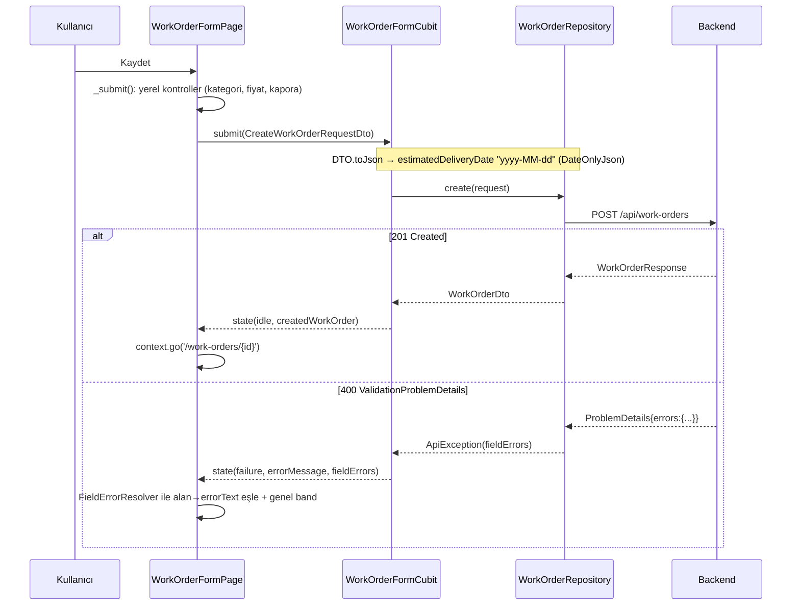
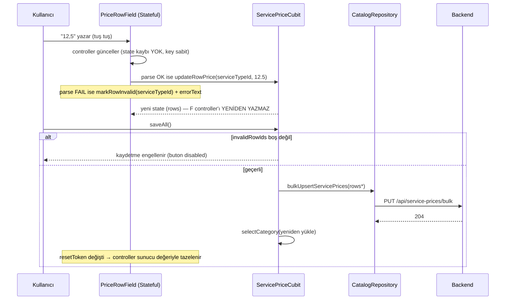
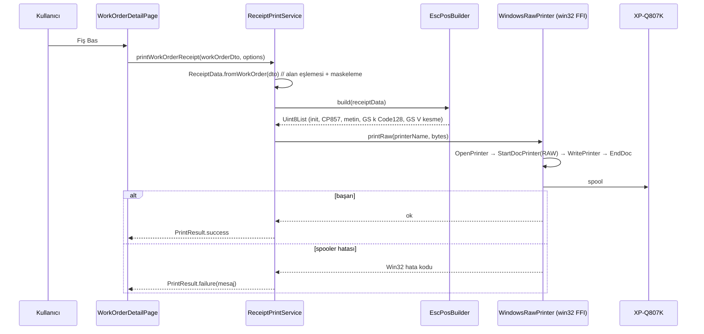
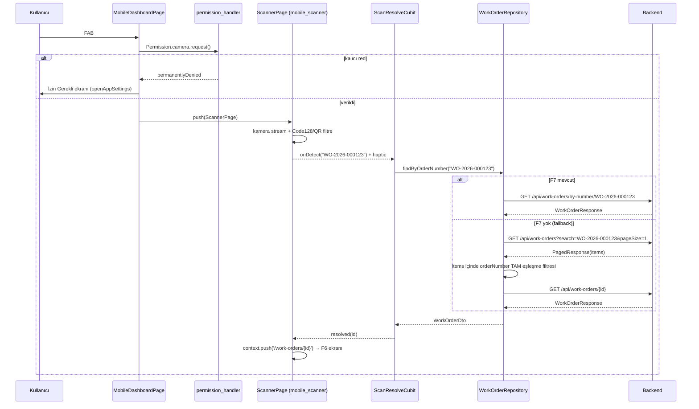
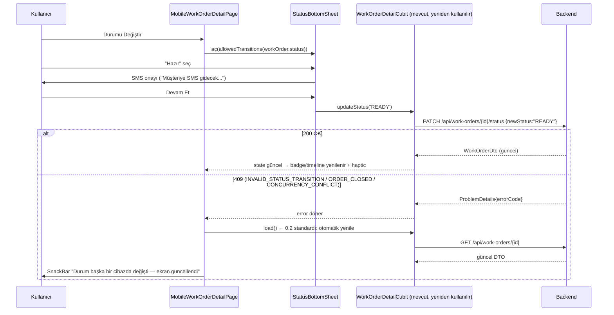

# Solution Design Document (SDD) — Atölye Yazılımı Geliştirme Paketi

> **Sürüm:** 1.0 · **Tarih:** 28 Temmuz 2026
> **Referans:** [`teknik-analiz-ve-gelistirme-plani.md`](./teknik-analiz-ve-gelistirme-plani.md) (bulgular, kök neden analizleri ve fazlar bu dokümandan gelir)
> **Amaç:** Geliştiricinin başka hiçbir kaynağa bakmadan implementasyona başlayabileceği seviyede tasarım: ekran akışları, sequence diyagramları, state yapıları, klasör/dosya planı, repository ve API eşlemesi, task breakdown, branch planı, acceptance criteria, QA senaryoları ve checklistler.

---

## İçindekiler

- [0. Ortak Standartlar ve Çapraz Kararlar](#0-ortak-standartlar)
- [F1 — İş Emri Validation Fix (DateOnly + alan bazlı hata)](#f1)
- [F2 — Price Matrix TextField Fix](#f2)
- [F3 — Dashboard Finans Kilidi (PIN)](#f3)
- [F4 — Desktop Barkod Fişi Yazdırma (XP-Q807K / ESC-POS)](#f4)
- [F5 — Mobil Kabuk + Mobil Dashboard + Barkod Tarayıcı](#f5)
- [F6 — Mobil Ürün Detayı + Status Değişimi](#f6)
- [F7 — (Opsiyonel Backend) Order Number ile Kesin Arama Ucu](#f7)
- [Ek A — Branch/Release Akış Özeti](#ek-a)
- [Ek B — Regresyon Matrisi](#ek-b)

---

<a name="0-ortak-standartlar"></a>
# 0. Ortak Standartlar ve Çapraz Kararlar

## 0.1 Branch ve Sürüm Stratejisi

- Ana dal: `main` *(Ek doğrulama: repo'da develop dalı kullanılıyorsa taban ona alınır; bu SDD `main` varsayar).*
- Adlandırma: `feature/<kod>-<kısa-ad>`, düzeltmeler `fix/…`, backend işleri `backend/…`.
- Her feature branch **tek başına merge edilebilir ve geri alınabilir** olmalı; F1–F4 birbirinden bağımsız, F5→F6 zinciri sıralı.
- Merge önkoşulu: `flutter analyze` temiz + ilgili testler yeşil + bu SDD'deki feature checklist'i PR açıklamasına işaretlenmiş olarak eklenmiş.
- Commit mesaj kalıbı: `<kod>: <özet>` (örn. `F1: DateOnly serializer eklendi`).

| Kod | Branch | Bağımlılık |
|---|---|---|
| F1 | `feature/f1-workorder-date-serialization` | — |
| F2 | `feature/f2-price-matrix-textfield` | — |
| F3 | `feature/f3-dashboard-finance-lock` | — |
| F4 | `feature/f4-receipt-printing` | F0 kararları (Seri No/Model) |
| F5 | `feature/f5-mobile-shell-scanner` | F3 (kilit servisi ortak), F4 (barkod içerik sözleşmesi), F7 (varsa) |
| F6 | `feature/f6-mobile-detail-status` | F5 |
| F7 | `backend/f7-workorder-by-number` | — (F5'ten önce merge edilmeli) |

## 0.2 Ortak Teknik Kararlar (tüm feature'lar uyar)

1. **Platform ayrımı:** Mobil/masaüstü kabuk seçimi **yalnızca** `Platform.isAndroid || Platform.isIOS` ile yapılır. Pencere boyutu (`LayoutBuilder`/`MediaQuery`) kabuk seçiminde **asla** kullanılmaz; yalnızca kabuk-içi responsive düzen için serbesttir. (Analiz §3.2 kararı.)
2. **Alan bazlı hata standardı:** `ApiException.fieldErrors` anahtarları backend'den iki biçimde gelebilir: model-binding hatalarında `$.alanAdi`, FluentValidation hatalarında `AlanAdi` (PascalCase). Ortak yardımcı `FieldErrorResolver` (F1'de eklenir) her iki biçimi normalize eder; sonraki tüm formlar bunu kullanır.
3. **409 standardı:** `errorCode ∈ {CONCURRENCY_CONFLICT, INVALID_STATUS_TRANSITION, ORDER_CLOSED}` alındığında istemci ilgili kaydı **otomatik yeniden yükler** ve kullanıcıya güncel durumu gösterir. F6'da zorunlu, masaüstünde F1/F2 kapsamı dışı ekranlara Phase 9'da yayılır.
4. **Yeni paketler:** Yalnızca ilgili feature branch'inde eklenir (analiz dokümanındaki "paket ekleme" kısıtı feature fazlarında kalkar): F4 → `win32`, `ffi`; F5 → `mobile_scanner`, `permission_handler`. F3 paketsizdir (`crypto` + `flutter_secure_storage` mevcut).
5. **Kod üretimi:** DTO değişikliklerinden sonra `dart run build_runner build --delete-conflicting-outputs` çalıştırılır ve üretilen dosyalar commit'lenir.
6. **Test komutları:** `flutter test` (unit/widget); backend için `dotnet test AtolyeProjesi/tests/LeatherCare.IntegrationTests`.

## 0.3 Kapsam Dışı (bu SDD'de tasarlanmadı)

- Offline çalışma/cache, token revocation, rol yönetimi (analiz §6'daki kabul edilen riskler).
- Sunucu taraflı finans yetkilendirmesi (analiz Sorun 3 kararı: istemci tarafı maskeleme).

---

<a name="f1"></a>
# F1 — İş Emri Validation Fix (DateOnly serileştirme + alan bazlı hata gösterimi)

## F1.1 Amaç ve Kök Neden

Flutter, `estimatedDeliveryDate` alanını `toIso8601String()` ile tam zaman damgası olarak gönderiyor; backend `DateOnly` beklediği için model binding 400 dönüyor (analiz Sorun 1). Ayrıca `WorkOrderFormState.fieldErrors` **zaten dolduruluyor** (`work_order_form_cubit.dart:70,102`) ama UI hiç kullanmıyor. F1 iki işi birden kapatır: doğru serileştirme + alan altı hata gösterimi.

## F1.2 Ekran Akışı

Ekran değişmez (İş Emri Formu). Davranış farkı:

```
[Yeni İş Emri / Düzenle]
   │ Kaydet
   ▼
(istek: estimatedDeliveryDate = "2026-08-15")   ← düzeltme
   │
   ├─ 2xx → detay sayfasına git (mevcut davranış)
   └─ 400 → genel hata bandı (mevcut) + İLGİLİ ALANIN ALTINDA errorText  ← yeni
```

## F1.3 Sequence Diagram



## F1.4 Dosya/Klasör Planı

```
lib/core/utils/
└── date_only_json.dart                  # YENİ — toJson/fromJson fonksiyonları
lib/core/network/
└── field_error_resolver.dart            # YENİ — fieldErrors anahtar normalizasyonu
lib/features/work_order/data/dto/
├── create_work_order_request_dto.dart   # DEĞİŞİR — @JsonKey eklenir
├── update_work_order_request_dto.dart   # DEĞİŞİR — @JsonKey eklenir
└── *.g.dart / *.freezed.dart            # build_runner ile yeniden üretilir
lib/features/work_order/presentation/pages/
└── work_order_form_page.dart            # DEĞİŞİR — errorText bağlanır
test/core/utils/date_only_json_test.dart              # YENİ
test/core/network/field_error_resolver_test.dart      # YENİ
test/features/work_order/work_order_form_page_test.dart # YENİ/GENİŞLER
```

## F1.5 Tasarım — Kod Sözleşmeleri

```dart
// lib/core/utils/date_only_json.dart
/// Backend DateOnly alanları için: gönderirken "yyyy-MM-dd", okurken DateTime.
String? dateOnlyToJson(DateTime? date) => date == null
    ? null
    : '${date.year.toString().padLeft(4, '0')}-'
      '${date.month.toString().padLeft(2, '0')}-'
      '${date.day.toString().padLeft(2, '0')}';

DateTime? dateOnlyFromJson(String? value) =>
    value == null ? null : DateTime.parse(value);
```

```dart
// DTO değişikliği (create + update, birebir aynı):
@JsonKey(toJson: dateOnlyToJson, fromJson: dateOnlyFromJson)
DateTime? estimatedDeliveryDate,
```

```dart
// lib/core/network/field_error_resolver.dart
class FieldErrorResolver {
  FieldErrorResolver(this._fieldErrors);
  final Map<String, List<String>> _fieldErrors;

  /// '$.estimatedDeliveryDate', 'EstimatedDeliveryDate', 'estimatedDeliveryDate'
  /// anahtarlarının hepsini aynı alana çözer.
  String? errorFor(String camelCaseField) {
    final candidates = {
      camelCaseField,
      '\$.$camelCaseField',
      camelCaseField[0].toUpperCase() + camelCaseField.substring(1),
    };
    for (final key in candidates) {
      final messages = _fieldErrors[key];
      if (messages != null && messages.isNotEmpty) return messages.join('\n');
    }
    return null;
  }

  bool get hasAny => _fieldErrors.isNotEmpty;
}
```

UI bağlama (form alanlarına eklenen tek satırlık desen):

```dart
final resolver = FieldErrorResolver(state.fieldErrors);
// ...
TextField(
  controller: _priceController,
  decoration: InputDecoration(
    labelText: 'Nihai Fiyat',
    errorText: resolver.errorFor('price'),
  ),
  ...
)
```

`errorText` bağlanacak alanlar: `brand`, `color`, `material`, `description`, `existingDamages`, `price`, `prepaymentAmount`; tarih satırının altına `estimatedDeliveryDate` hatası ayrı `Text` olarak (tarih `TextField` değil). Yeni submit başlarken `fieldErrors` temizlenir (cubit'te `submit`/`submitUpdate` başında `fieldErrors: const {}` — copyWith'e mevcut parametre yeterli).

**State değişikliği yok:** `WorkOrderFormState.fieldErrors` zaten mevcut; yalnızca cubit'in submit başlangıcında temizleme eklenir.

## F1.6 API Mapping

| İşlem | Endpoint | Gönderilen | Değişiklik |
|---|---|---|---|
| Oluştur | `POST /api/work-orders` | `CreateWorkOrderRequestDto` | `estimatedDeliveryDate` → `"yyyy-MM-dd"` |
| Güncelle | `PUT /api/work-orders/{id}` | `UpdateWorkOrderRequestDto` | Aynı; `updatedAt` **dokunulmaz** (date-time kalır) |

Backend değişikliği: **yok.**

## F1.7 Task Breakdown

| # | Task | Tahmin | Çıktı |
|---|---|---|---|
| F1-T1 | `date_only_json.dart` + unit test (null, tek haneli ay/gün, yıl<1000 padding) | 1 sa | util + test |
| F1-T2 | İki DTO'ya `@JsonKey` + build_runner + üretilen kodda `'yyyy-MM-dd'` doğrulaması | 1 sa | DTO + g.dart |
| F1-T3 | `FieldErrorResolver` + unit test (3 anahtar biçimi, çoklu mesaj, boş harita) | 1.5 sa | resolver + test |
| F1-T4 | Cubit: submit başında fieldErrors temizliği | 0.5 sa | cubit |
| F1-T5 | Form alanlarına `errorText` bağlama (7 alan + tarih satırı) | 2 sa | form page |
| F1-T6 | Widget testi: sahte 400 (errors: `$.estimatedDeliveryDate`) → alan altında mesaj | 2 sa | widget test |
| F1-T7 | Manuel regresyon: tarihli/tarihsiz create, tarihli update, edit-modu round-trip | 1 sa | test kaydı |

**Toplam:** ~1 gün.

## F1.8 Acceptance Criteria

1. **Given** formda tahmini teslim tarihi seçilmiş, **when** Kaydet'e basılır, **then** istek gövdesinde `"estimatedDeliveryDate":"yyyy-MM-dd"` gider ve kayıt 201 ile oluşur.
2. **Given** tarih seçilmemiş, **when** kaydedilir, **then** alan `null` gider ve davranış öncekiyle aynıdır (regresyon yok).
3. **Given** düzenleme modunda tarihli bir kayıt, **when** hiçbir şey değiştirmeden kaydedilir, **then** 200 döner ve tarih değeri değişmez (round-trip kayıpsız).
4. **Given** backend 400 + `errors` haritası döner, **when** yanıt işlenir, **then** ilgili alan(lar)ın altında backend mesajı görünür **ve** genel hata bandı korunur.
5. Yeni bir submit başladığında önceki alan hataları temizlenir.
6. `updatedAt` serileştirmesi değişmemiştir (üretilen kodda `toIso8601String()` kalır).

## F1.9 QA Test Senaryoları

| ID | Senaryo | Adımlar | Beklenen |
|---|---|---|---|
| F1-QA1 | Tarihli create | Müşteri seç → tür seç → tarih seç → Kaydet | Detay sayfası açılır; DB'de tarih doğru gün |
| F1-QA2 | Tarihsiz create | Tarih seçmeden Kaydet | Başarılı; detayda "Tahmini Teslim" satırı yok |
| F1-QA3 | Tarihli update | Mevcut kaydı aç → farklı tarih → Kaydet | Başarılı; yeni tarih detayda doğru |
| F1-QA4 | Ay/gün sınırları | 01.01 ve 31.12 ve tek haneli gün/ay tarihleri | Hepsi başarılı (padding doğru) |
| F1-QA5 | Alan hatası görünümü | Kaporayı fiyattan büyük gir (backend 400 `PrepaymentAmount`) | "Kapora fiyatı aşamaz." kapora alanının altında |
| F1-QA6 | Hata temizliği | QA5 sonrası değeri düzelt → Kaydet | Eski errorText kaybolur, kayıt başarılı |
| F1-QA7 | Saat dilimi | Sistem saati 23:30 iken yarına tarih seç | Gönderilen gün, seçilen günle aynı (UTC kayması yok) |

## F1.10 Geliştirme Checklist

- [ ] `dateOnlyToJson` padding testleri yeşil
- [ ] Create **ve** update DTO'larının `.g.dart` çıktısında `dateOnlyToJson` görünüyor
- [ ] `updatedAt` üretilen kodda değişmedi (diff kontrolü)
- [ ] 7 alan + tarih satırında errorText bağlı
- [ ] Submit başında fieldErrors sıfırlanıyor
- [ ] Widget test: 400 → alan altı mesaj
- [ ] Manuel: F1-QA1..QA7 tamam
- [ ] `flutter analyze` temiz, PR'da checklist işaretli

---

<a name="f2"></a>
# F2 — Price Matrix TextField Fix

## F2.1 Amaç ve Kök Neden

`service_price_tab.dart:124`'te `TextFormField` key'i `row.price` içeriyor; her tuş vuruşu cubit emit'i → key değişimi → widget state kaybı → alan `initialValue`'ya döner (analiz Sorun 4). Çözüm: fiyat alanını kendi `TextEditingController`'ını yöneten, key'i yalnızca `serviceTypeId` olan bir stateful satır widget'ına taşımak; geçersiz girdiyi görünür kılmak.

## F2.2 Ekran Akışı

```
[Katalog → Fiyat Matrisi]
  Ürün türü seç ──► satırlar yüklenir (loading→loaded)
  Satırda fiyat yaz ──► alan ASLA sıfırlanmaz; geçersizse altında "Geçersiz tutar"
  Checkbox (aktif) değiştir ──► fiyat alanları etkilenmez
  [Tümünü Kaydet] ──► geçersiz alan varsa buton devre dışı + uyarı
                  └─► geçerliyse PUT bulk → yeniden yükle → alanlar sunucu değeriyle tazelenir
```

## F2.3 Sequence Diagram



## F2.4 Dosya/Klasör Planı

```
lib/features/catalog/presentation/widgets/
├── service_price_tab.dart          # DEĞİŞİR — inline TextFormField kaldırılır
└── price_row_field.dart            # YENİ — stateful fiyat alanı
lib/features/catalog/presentation/cubit/
├── service_price_cubit.dart        # DEĞİŞİR — invalid takibi + emit azaltma
└── service_price_state.dart        # DEĞİŞİR — invalidRowIds alanı
lib/core/utils/
└── tr_decimal.dart                 # YENİ — ortak TR ondalık parse + input formatter
test/features/catalog/price_row_field_test.dart        # YENİ
test/features/catalog/service_price_cubit_test.dart    # YENİ/GENİŞLER
```

## F2.5 Tasarım — Kod Sözleşmeleri

```dart
// lib/core/utils/tr_decimal.dart
/// "12,5" | "12.5" | "12" → double; boş/geçersiz → null.
double? parseTrDecimal(String raw) =>
    double.tryParse(raw.trim().replaceAll(',', '.'));

/// Rakam + en fazla bir ayraç + en fazla 2 ondalık hane.
final trDecimalInputFormatter =
    FilteringTextInputFormatter.allow(RegExp(r'^\d*[,.]?\d{0,2}$'));
```

```dart
// lib/features/catalog/presentation/widgets/price_row_field.dart
class PriceRowField extends StatefulWidget {
  const PriceRowField({
    super.key,                    // parent: ValueKey(row.serviceTypeId)
    required this.initialPrice,   // satır ilk kurulduğunda gösterilecek değer
    required this.resetToken,     // kategori/yeniden yükleme kimliği (aşağıya bkz.)
    required this.onValidChanged, // (double) → cubit.updateRowPrice
    required this.onValidityChanged, // (bool isValid) → cubit.setRowValidity
  });
  ...
}

class _PriceRowFieldState extends State<PriceRowField> {
  late final TextEditingController _controller =
      TextEditingController(text: widget.initialPrice.toStringAsFixed(2));
  String? _errorText;

  @override
  void didUpdateWidget(covariant PriceRowField old) {
    super.didUpdateWidget(old);
    // YALNIZCA resetToken değişince (kategori değişimi / kaydet-sonrası reload)
    // controller sunucu değeriyle yeniden yazılır. Cubit emit'leri dokunmaz.
    if (old.resetToken != widget.resetToken) {
      _controller.text = widget.initialPrice.toStringAsFixed(2);
      _errorText = null;
    }
  }
  // onChanged: parseTrDecimal → null ise _errorText='Geçersiz tutar' +
  // onValidityChanged(false); değilse temizle + onValidChanged(value).
}
```

**`resetToken` tanımı:** `ServicePriceState`'e eklenen `int reloadStamp` (her `selectCategory` başarılı yüklemesinde +1). Böylece "kaydet → yeniden yükle" sonrası alanlar sunucu değeriyle tazelenir, ama tuş vuruşu emit'leri alanı ezmez.

```dart
// service_price_state.dart — eklenen alanlar
final Set<int> invalidRowIds;   // parse edilemeyen satırların serviceTypeId'leri
final int reloadStamp;          // resetToken kaynağı
bool get canSave => invalidRowIds.isEmpty;
```

```dart
// service_price_cubit.dart — eklenen API
void setRowValidity(int serviceTypeId, bool isValid);  // invalidRowIds günceller
// saveAll(): state.canSave false ise erken döner (buton zaten disabled).
```

`ServicePriceTab` değişimi: `ListTile.trailing` içine `PriceRowField(key: ValueKey(row.serviceTypeId), initialPrice: row.price, resetToken: priceState.reloadStamp, ...)`; `ElevatedButton.onPressed` koşuluna `priceState.canSave` eklenir; kaydet butonunun üstünde geçersiz satır varsa uyarı satırı gösterilir.

**Emit azaltma (ikincil iyileştirme):** Liste `BlocConsumer` yerine satır listesi için `buildWhen: (p, n) => p.rows.length != n.rows.length || p.status != n.status || p.reloadStamp != n.reloadStamp` kullanır — tuş vuruşu emit'leri listeyi hiç rebuild etmez (checkbox güncellemesi satır-içi `BlocSelector` ile çözülür veya rows-length koşuluna `isActive` seçicisi eklenir; implementasyonda tercih serbest, AC-4 sağlanmalı).

## F2.6 API Mapping

| İşlem | Endpoint | Not |
|---|---|---|
| Satırları getir | `GET /api/service-prices?categoryId={id}` | Değişiklik yok |
| Toplu kaydet | `PUT /api/service-prices/bulk` | Gövde üretimi aynı (`hasExistingPrice \|\| isActive` filtresi **korunur**) |

Backend değişikliği: **yok.**

## F2.7 Task Breakdown

| # | Task | Tahmin |
|---|---|---|
| F2-T1 | `tr_decimal.dart` + unit test (virgül, nokta, "12,", boş, "abc", 2+ hane) | 1 sa |
| F2-T2 | `PriceRowField` widget'ı (controller, didUpdateWidget, errorText, formatter) | 3 sa |
| F2-T3 | State/cubit: `invalidRowIds`, `reloadStamp`, `setRowValidity`, `canSave` guard | 2 sa |
| F2-T4 | `ServicePriceTab` entegrasyonu + buildWhen emit azaltma | 2 sa |
| F2-T5 | Widget test: 5 karakter art arda yaz → alan içeriği korunur; imleç sonda | 2 sa |
| F2-T6 | Widget test: "12," yaz → error görünür + Kaydet disabled; "12,5" → düzelir | 1.5 sa |
| F2-T7 | Cubit test: görünen==gönderilen (updateRowPrice sonrası saveAll gövdesi) | 1.5 sa |
| F2-T8 | Manuel: kategori değiştir → alanlar tazelenir; kaydet → sunucu değeri döner | 1 sa |

**Toplam:** ~2 gün.

## F2.8 Acceptance Criteria

1. **Given** fiyat alanına odaklanılmış, **when** art arda karakter yazılır, **then** alan içeriği ve imleç konumu hiçbir tuş vuruşunda sıfırlanmaz.
2. **Given** `"12,5"` yazılmış, **when** Tümünü Kaydet, **then** gönderilen gövdede o satırın `price` değeri `12.5`'tir (görünen == gönderilen).
3. **Given** alanda parse edilemeyen ara girdi (`"12,"`, boş), **then** alan altında "Geçersiz tutar" görünür ve Kaydet butonu devre dışıdır; girdi düzelince buton açılır.
4. **Given** başka bir satırın checkbox'ı değiştirilir, **then** odaklı fiyat alanının içeriği/odağı etkilenmez.
5. **Given** kategori değiştirilir veya kaydet sonrası yeniden yükleme olur, **then** tüm alanlar sunucu değeriyle tazelenir.
6. `saveAll()`'un satır filtresi (`hasExistingPrice || isActive`) davranışı değişmemiştir.

## F2.9 QA Test Senaryoları

| ID | Senaryo | Beklenen |
|---|---|---|
| F2-QA1 | "1500" hızlı yaz (10+ tuş/sn) | Alan "1500"; sıçrama yok |
| F2-QA2 | "99,99" → Kaydet → sayfayı yeniden yükle | Sunucudan 99.99 döner, alanda "99.99" |
| F2-QA3 | Alanı tamamen sil → Kaydet dene | Error + buton disabled |
| F2-QA4 | 30 satırlık kategoride bir alana yaz | Diğer 29 satır rebuild kaynaklı takılma yok (kare düşüşü gözle) |
| F2-QA5 | Fiyat yaz → checkbox'ı kapat → tekrar aç → Kaydet | Yazılan fiyat korunur ve gönderilir |
| F2-QA6 | İki farklı kategori arasında gidip gel | Her kategori kendi değerlerini gösterir; sızıntı yok |
| F2-QA7 | Kaydet sırasında API hatası (ağ kes) | SnackBar hata; girilen değerler alanlarda DURUR |

## F2.10 Geliştirme Checklist

- [ ] `PriceRowField` key'i yalnızca `serviceTypeId`
- [ ] `didUpdateWidget` yalnız `resetToken` değişiminde controller yazıyor
- [ ] `invalidRowIds` boşken/doluyken buton durumu doğru
- [ ] `hasExistingPrice || isActive` filtresi dokunulmadı
- [ ] Widget + cubit testleri yeşil
- [ ] F2-QA1..QA7 manuel tamam
- [ ] `flutter analyze` temiz

---

<a name="f3"></a>
# F3 — Dashboard Finans Kilidi (PIN + oturum süreli açma)

## F3.1 Amaç

Ciro kartları varsayılan maskeli; 4-6 haneli yerel PIN ile açılır; 5 dk sonra veya sayfadan/oturumdan çıkışta yeniden kilitlenir (analiz Sorun 3 kararı). **İstemci tarafı görsel koruma** olduğu bilinçli karardır; F5'te mobil aynı servisi kullanır.

## F3.2 Ekran Akışı

```
[Dashboard açılır]
  Finans kartları: "₺ ••••" + kilit ikonu + [Göster]
     │ Göster
     ▼
  PIN tanımlı mı? ──hayır──► [PIN Belirle diyaloğu: PIN + tekrar] ──► kaydet + AÇ
     │ evet
     ▼
  [PIN Gir diyaloğu]
     ├─ doğru ──► kartlar açılır (5 dk sayaç) ; sayaç bitince/logout'ta kilitlenir
     ├─ yanlış ──► "Hatalı PIN (n/5)" ; 5. hatada 60 sn kilitleme geri sayımı
     └─ "PIN'i unuttum" ──► onay diyaloğu ──► PIN silinir + logout zorlanır
                                              (yeniden login = kimlik kanıtı)
```

## F3.3 Sequence Diagram

```mermaid
sequenceDiagram
    participant U as Kullanıcı
    participant D as DashboardPage
    participant L as FinanceLockController
    participant S as SecureStorage

    D->>L: build: isUnlocked?
    L-->>D: false → kartlar maskeli
    U->>D: [Göster]
    D->>L: hasPin?
    L->>S: read(finance_pin_hash)
    alt PIN yok
        D->>U: PIN Belirle diyaloğu
        U->>D: PIN + tekrar
        D->>L: setPin(pin)
        L->>S: write(hash=SHA256(salt+pin), salt)
        L-->>D: unlock() → notifyListeners
    else PIN var
        D->>U: PIN Gir diyaloğu
        U->>D: pin
        D->>L: verify(pin)
        alt doğru
            L-->>D: unlocked=true + 5dk Timer
        else yanlış
            L-->>D: failedAttempts++ ; 5'te lockoutUntil=now+60sn
        end
    end
    Note over L: Timer dolunca / logout / dispose → lock() + notifyListeners
```

## F3.4 Dosya/Klasör Planı

```
lib/core/security/
├── finance_lock_controller.dart   # YENİ — ChangeNotifier (kilit durumu + sayaç)
└── pin_store.dart                 # YENİ — hash/salt üretimi ve secure storage IO
lib/core/constants/storage_keys.dart   # DEĞİŞİR — 2 anahtar eklenir
lib/core/di/injection.dart              # DEĞİŞİR — FinanceLockController singleton
lib/features/dashboard/presentation/widgets/
├── summary_card.dart              # DEĞİŞİR — masked parametresi
├── revenue_summary_card.dart      # DEĞİŞİR — masked parametresi
└── pin_dialog.dart                # YENİ — belirle/doğrula modları tek widget
lib/features/dashboard/presentation/pages/dashboard_page.dart  # DEĞİŞİR
lib/app/app_startup_controller.dart     # DEĞİŞİR — logout() içinde lock()
test/core/security/pin_store_test.dart
test/core/security/finance_lock_controller_test.dart
test/features/dashboard/finance_mask_test.dart
```

## F3.5 Tasarım — Kod Sözleşmeleri

```dart
// storage_keys.dart eklemeleri
static const String financePinHash = 'finance_pin_hash';
static const String financePinSalt = 'finance_pin_salt';
```

```dart
// lib/core/security/pin_store.dart
class PinStore {
  PinStore(this._storage);           // ISecureStorageService (mevcut arayüz)
  Future<bool> hasPin();
  Future<void> setPin(String pin);   // salt = 16 rasgele bayt (Random.secure)
                                     // hash = sha256(salt + utf8(pin)) [crypto pkg]
  Future<bool> verify(String pin);   // sabit-zaman karşılaştırma gerekmez (yerel)
  Future<void> clear();              // "PIN'i unuttum" akışı
}
```

```dart
// lib/core/security/finance_lock_controller.dart
class FinanceLockController extends ChangeNotifier {
  FinanceLockController(this._pinStore, {this.autoLock = const Duration(minutes: 5)});

  bool get isUnlocked;
  int get failedAttempts;            // maks 5
  DateTime? get lockoutUntil;        // 5 hatada now+60sn; süre dolunca sıfırlanır
  Future<bool> hasPin();
  Future<void> setPinAndUnlock(String pin);
  Future<PinVerifyResult> unlock(String pin); // ok | wrong | lockedOut
  void lock();                       // timer iptal + notify
  Future<void> resetPin();           // clear + lock (çağıran logout'u tetikler)
}
```

- Kayıt: `injection.dart`'ta lazy singleton (`ISecureStorageService` üstüne). Dashboard'da `AnimatedBuilder(animation: financeLock, ...)` veya `ListenableBuilder` ile dinlenir — yeni state-management kalıbı eklenmez (mevcut `AppStartupController` deseniyle aynı).
- `SummaryCard`'a `final bool masked;` (+ `onUnlockTap`) eklenir: masked iken değer `'₺ ••••'`, sağ üstte kilit ikonu. **DTO ve `_isEmpty()` mantığına dokunulmaz** (maskeleme yalnız görsel — analiz Sorun 3 yan etkisi).
- `AppStartupController.logout()` → `getIt<FinanceLockController>().lock()` çağrısı (DI üzerinden, import döngüsüz).
- PIN kuralları: 4-6 hane, yalnız rakam; `PinDialog` `keyboardType: number`, `obscureText: true`, otomatik odak.

## F3.6 API Mapping

Değişiklik yok — `GET /api/dashboard/summary` aynen kullanılır; maskeleme tamamen istemcide. (Sunucu taraflı ayrıştırma bilinçli kapsam dışı, bkz. §0.3.)

## F3.7 Task Breakdown

| # | Task | Tahmin |
|---|---|---|
| F3-T1 | `PinStore` (salt+hash+verify+clear) + unit test | 2 sa |
| F3-T2 | `FinanceLockController` (unlock/lock/timer/deneme sınırı) + unit test (fake clock) | 3 sa |
| F3-T3 | `PinDialog` (belirle/doğrula/lockout geri sayımı) | 3 sa |
| F3-T4 | `SummaryCard`/`RevenueSummaryCard` masked varyantı | 2 sa |
| F3-T5 | Dashboard entegrasyonu (Listenable dinleme + Göster akışı) | 2 sa |
| F3-T6 | Logout'ta kilitleme + "PIN'i unuttum" akışı | 1.5 sa |
| F3-T7 | Widget test: maskeli→PIN→açık→timer→maskeli döngüsü | 2 sa |

**Toplam:** ~2 gün.

## F3.8 Acceptance Criteria

1. Uygulama her açılışta finans kartlarını **maskeli** gösterir (önceki oturumda açılmış olsa bile).
2. **Given** PIN tanımlı değil, **when** Göster'e basılır, **then** PIN belirleme akışı çalışır ve başarılı belirlemede kartlar açılır.
3. **Given** doğru PIN girilir, **then** kartlar açılır ve 5 dk sonra kendiliğinden maskelenir.
4. **Given** 5 kez yanlış PIN, **then** 60 sn boyunca giriş denenemez ve geri sayım görünür.
5. Logout → kartlar kilitli; "PIN'i unuttum" → PIN silinir ve kullanıcı login'e düşürülür.
6. Maskeleme yalnız görseldir: `_isEmpty()` boş-veri davranışı ve diğer dashboard kartları değişmez.
7. PIN düz metin olarak **hiçbir yerde** saklanmaz/loglanmaz (yalnız salt+SHA-256 secure storage'da).

## F3.9 QA Test Senaryoları

| ID | Senaryo | Beklenen |
|---|---|---|
| F3-QA1 | İlk kurulum: Göster → PIN belirle (1234) | Kartlar açık; storage'da hash+salt var, "1234" YOK |
| F3-QA2 | Uygulamayı kapat-aç | Maskeli başlar; 1234 ile açılır |
| F3-QA3 | 5 yanlış deneme | 60 sn kilit + geri sayım; süre sonunda tekrar denenebilir |
| F3-QA4 | Açıkken 5 dk bekle | Otomatik maskelenir |
| F3-QA5 | Açıkken logout → tekrar login | Maskeli |
| F3-QA6 | PIN'i unuttum | Onay → logout; yeniden login sonrası Göster → PIN belirleme akışı |
| F3-QA7 | Dashboard boşken (yeni kurulum) | "Henüz dashboard verisi..." mesajı hâlâ doğru çalışır |
| F3-QA8 | Yenile (refresh) açıkken | Kilit durumu korunur (refresh kilidi sıfırlamaz) |

## F3.10 Geliştirme Checklist

- [ ] Yeni paket eklenmedi (crypto + secure_storage mevcut)
- [ ] PIN yalnız hash+salt olarak saklanıyor; diagnostics log'a PIN düşmüyor
- [ ] Timer dispose/lock yolları sızıntısız (controller test)
- [ ] `_isEmpty()` ve DTO değişmedi
- [ ] Logout kilitliyor
- [ ] F3-QA1..QA8 tamam
- [ ] `flutter analyze` temiz

---

<a name="f4"></a>
# F4 — Desktop Barkod Fişi Yazdırma (XP-Q807K / ESC-POS)

## F4.1 Amaç ve Karar Özeti

İş Emri Detay sayfasına "Fiş Bas" (Barkod Oluştur) eklenir. Fiş: 80 mm termal, **Code128 içeriği = `orderNumber`** (F5 ile sözleşme), düzen analiz §3.1'deki şablon. Yazdırma yolu: **ESC/POS byte'ları → Windows RAW spooler** (`win32`+`ffi`); LAN varyantı için TCP 9100 ikincil yol. *(Ek doğrulama: cihaz arabirimi — F0 kararı. Seri No/Model alanları eklenmeyecekse fişten çıkarılır; eklenecekse önce F7-benzeri ayrı backend işi açılır.)*

## F4.2 Ekran Akışı

```
[İş Emri Detay]
  Başlık satırı: [Order No] [Badge] ... [🖨 Fiş Bas] [🔗 Link]
     │ Fiş Bas
     ▼
  Yazıcı seçili mi? (ayar: selected_printer_name)
     ├─ hayır ──► [Yazıcı Seç diyaloğu: sistem yazıcı listesi + "Test Fişi Bas"]
     └─ evet
     ▼
  [Önizleme diyaloğu (ops.)]: kopya sayısı (1/2), telefon maskele (aç/kapa)
     │ Yazdır
     ▼
  ESC/POS üret → spooler'a RAW yaz
     ├─ OK  ──► SnackBar "Fiş yazdırıldı"
     └─ HATA ──► SnackBar "Yazıcıya erişilemedi: <neden>" + [Yazıcı Ayarları] aksiyonu
```

## F4.3 Sequence Diagram



## F4.4 Dosya/Klasör Planı

```
lib/features/receipt_printing/
├── domain/
│   ├── receipt_data.dart            # WorkOrderDto → fiş alanları (saf, testlenebilir)
│   └── print_result.dart
├── data/
│   ├── escpos/
│   │   ├── escpos_builder.dart      # komut üretimi (aşağıda komut seti)
│   │   └── cp857_encoder.dart       # UTF-8 → CP857 + bilinmeyen karakter '?' fallback
│   └── printer/
│       ├── receipt_printer.dart     # abstract: printRaw(bytes)
│       ├── windows_raw_printer.dart # win32 spooler implementasyonu
│       └── network_printer.dart     # TCP 9100 (LAN varyantı, ops.)
├── application/
│   └── receipt_print_service.dart   # orkestrasyon + yazıcı seçimi + test fişi
└── presentation/
    ├── printer_settings_dialog.dart # yazıcı listele/seç/test bas
    └── print_receipt_action.dart    # detay sayfasındaki buton + önizleme diyaloğu
lib/core/constants/storage_keys.dart # DEĞİŞİR — selectedPrinterName
pubspec.yaml                          # DEĞİŞİR — win32, ffi
test/features/receipt_printing/
├── receipt_data_test.dart
├── escpos_builder_test.dart          # byte dizisi snapshot testleri
└── cp857_encoder_test.dart
```

## F4.5 Tasarım — Fiş Şablonu ve Komut Seti

**Fiziksel sabitler:** 80 mm kağıt → 72 mm / **576 nokta** yazdırılabilir alan (203 dpi); Font A 12×24 → 48 sütun.

| Sıra | Bölge | ESC/POS |
|---|---|---|
| 1 | Atölye adı (ortalı, çift boy) | `ESC a 1` + `GS ! 0x11` |
| 2 | `orderNumber` (ortalı, çift yükseklik) | `GS ! 0x01` |
| 3 | **Code128** (h=100 nokta, module=2, HRI altta) | `GS h 100` · `GS w 2` · `GS H 2` · `GS k 73 n {B} data` |
| 4 | Müşteri adı + telefon (maskeleme opsiyonuna göre `0532 *** ** 67`) | Font A |
| 5 | Ürün bloğu: kategori yolu, marka, renk, malzeme (+ Seri No/Model — F0 kararı) | Font A, `null` alan satırı basılmaz |
| 6 | Arıza: `description` / `existingDamages` (48 sütuna sarmalanır) | Font A |
| 7 | Kabul: `createdAt` (dd.MM.yyyy HH:mm) · Tah.Teslim · Durum (TR etiket) · Basım zamanı | Font A |
| 8 | (ops.) Takip QR (`trackingUrl`) | `GS ( k` model 2, size 5 |
| 9 | 4 satır boşluk + kısmi kesme | `GS V 66 0` |

Kod sözleşmeleri:

```dart
// domain/receipt_data.dart
class ReceiptData {
  factory ReceiptData.fromWorkOrder(WorkOrderDto dto, {required bool maskPhone});
  final String orderNumber;      // barkod içeriği DE bu (F5 sözleşmesi)
  final String customerName;
  final String phone;            // maskPhone ise maskeli üretilmiş
  final String categoryPath;
  final String? brand, color, material, description, existingDamages;
  final DateTime createdAt;
  final DateTime? estimatedDeliveryDate;
  final String statusLabel;      // TR: "Teslim Alındı" vb. (WorkOrderStatusBadge eşlemesi yeniden kullanılır)
  final String? trackingUrl;
  final DateTime printedAt;
}
```

```dart
// application/receipt_print_service.dart
class ReceiptPrintService {
  Future<List<String>> listPrinters();                  // EnumPrinters (win32)
  Future<PrintResult> printWorkOrderReceipt(WorkOrderDto dto, PrintOptions opts);
  Future<PrintResult> printTestReceipt();               // tanılama fişi
}
class PrintOptions { final int copies; final bool maskPhone; final bool includeTrackingQr; }
```

- `EscPosBuilder` **saf fonksiyondur** (IO yok) → byte-snapshot unit testleri yazılır.
- `Cp857Encoder`: TR karakter tablosu (ç,ğ,ı,İ,ö,ş,ü + büyükleri) elle eşlenir; tablo dışı karakter `?`. `ESC t` ile CP857 sayfası seçilir (Xprinter kod sayfası numarası cihazda doğrulanır — F4-QA1).
- `WindowsRawPrinter`: `OpenPrinter/StartDocPrinter(pDatatype:"RAW")/StartPagePrinter/WritePrinter/EndPagePrinter/EndDocPrinter/ClosePrinter`; her Win32 hatası `GetLastError` ile `PrintResult.failure`'a çevrilir.
- DI: `injection.dart`'a `ReceiptPrintService` lazy singleton; `Platform.isWindows` değilse buton gizlenir (macOS geliştirme ortamında crash yok).

## F4.6 API Mapping

| İşlem | Endpoint | Not |
|---|---|---|
| Fiş verisi | `GET /api/work-orders/{id}` (zaten detayda yüklü `WorkOrderDto`) | **Yeni istek atılmaz**; ekrandaki DTO kullanılır |

Backend değişikliği: **yok** (Seri No/Model istenirse ayrı backend işi — F0 kararına bağlı, bu branch'e girmez).

## F4.7 Task Breakdown

| # | Task | Tahmin |
|---|---|---|
| F4-T1 | Paketler (`win32`, `ffi`) + `Platform.isWindows` guard iskeleti | 1 sa |
| F4-T2 | `ReceiptData.fromWorkOrder` + maskeleme + unit test | 2 sa |
| F4-T3 | `Cp857Encoder` + unit test (tüm TR karakterleri) | 2 sa |
| F4-T4 | `EscPosBuilder` (metin/hizalama/boyut/Code128/QR/kesme) + snapshot test | 4 sa |
| F4-T5 | `WindowsRawPrinter` (EnumPrinters + RAW yazım + hata eşleme) | 4 sa |
| F4-T6 | `ReceiptPrintService` + yazıcı ayar kalıcılığı (`selectedPrinterName`) | 2 sa |
| F4-T7 | `PrinterSettingsDialog` + "Test Fişi Bas" | 2 sa |
| F4-T8 | Detay sayfası butonu + önizleme/kopya/maske diyaloğu | 2 sa |
| F4-T9 | Saha testi: gerçek XP-Q807K ile barkod okunurluk + TR karakter + kesme | 3 sa |

**Toplam:** ~3 gün (+saha testi).

## F4.8 Acceptance Criteria

1. **Given** açık bir iş emri detayı ve seçili yazıcı, **when** Fiş Bas → Yazdır, **then** XP-Q807K'dan §F4.5 şablonuna uygun fiş çıkar ve fiş sonunda kağıt kesilir.
2. Fişteki Code128, el terminali **ve** telefon kamerasıyla okunduğunda tam olarak `orderNumber` değerini verir (örn. `WO-2026-000123`).
3. Türkçe karakterler (ç, ğ, ı, İ, ö, ş, ü) fişte doğru basılır.
4. `null` alanlar (marka yok vb.) fişte satır olarak görünmez; telefon maskeleme seçeneği çalışır.
5. **Given** yazıcı kapalı/yok, **then** kullanıcı 10 sn içinde anlaşılır hata + "Yazıcı Ayarları" aksiyonu görür; uygulama kilitlenmez.
6. Yazıcı seçimi kalıcıdır (uygulama yeniden başlatılınca hatırlanır); "Test Fişi Bas" çalışır.
7. Windows dışı platformda buton görünmez; derleme bozulmaz.
8. Kopya sayısı 2 seçilirse iki ayrı kesilmiş fiş çıkar.

## F4.9 QA Test Senaryoları

| ID | Senaryo | Beklenen |
|---|---|---|
| F4-QA1 | Test fişi: TR pangram + örnek barkod | Karakterler doğru; barkod okunur; kesme çalışır |
| F4-QA2 | Tüm alanları dolu iş emri fişi | Şablondaki 9 bölge doğru sırada, 48 sütun taşması yok |
| F4-QA3 | Minimum alanlı iş emri (yalnız zorunlular) | Boş satır blokları yok; düzen bozulmuyor |
| F4-QA4 | Çok uzun açıklama (500+ karakter) | Sarmalama düzgün; fiş makul uzunlukta kesiliyor |
| F4-QA5 | Yazıcı kablosu çekili | Hata mesajı; uygulama donmuyor; kablo takılınca tekrar dene çalışıyor |
| F4-QA6 | Kağıt bitti | Spooler/cihaz hatası kullanıcıya yansıyor *(Ek doğrulama: XP-Q807K kağıt-yok sinyalini spooler'a iletiyor mu — sahada test)* |
| F4-QA7 | 2 kopya + telefon maskeli | İki fiş; telefon `0532 *** ** 67` biçiminde |
| F4-QA8 | Barkodu F5 mobil tarayıcı ile okut | `orderNumber` birebir çözülür (F5 entegrasyon köprüsü) |

## F4.10 Geliştirme Checklist

- [ ] `EscPosBuilder` snapshot testleri yeşil (barkod komut baytları dahil)
- [ ] CP857 tablosunda 12 TR karakterin tamamı var
- [ ] RAW yazımda tüm Win32 hataları `PrintResult.failure`'a eşleniyor
- [ ] Yazıcı adı secure storage'da kalıcı
- [ ] Windows-dışı guard'lar (buton gizli, DI koşullu)
- [ ] Gerçek cihazda F4-QA1..QA8 tamam
- [ ] Barkod içerik sözleşmesi (`orderNumber`) README/fişte dokümante

---

<a name="f5"></a>
# F5 — Mobil Kabuk + Mobil Dashboard + Barkod Tarayıcı

## F5.1 Amaç

Android/iOS platform iskeleti; **platform-bazlı** kabuk (2 ekran: Dashboard + tarayıcı akışı); FAB → kamera izni → Code128/QR tarama → iş emri çözümleme → detay (F6 ekranına yönlendirme).

## F5.2 Ekran Akışı

```
[Splash] ──token──► [Login (mevcut sayfa, mobil uyumlu)]
                        │
                        ▼
                 [Mobil Dashboard]  ◄────────────────────┐
                  - AppBar: logo + çıkış                  │
                  - RefreshIndicator + KPI kartları       │
                  - Finans kartları F3 kilidiyle          │
                  - Disk/Arşiv kartları GİZLİ             │
                  - FAB (sağ alt, 64dp, barkod ikonu)     │
                        │ FAB                             │
                        ▼                                 │
                 [Kamera izni?]                           │
                  ├─ verilmedi → sistem diyaloğu          │
                  ├─ kalıcı red → [İzin Gerekli ekranı:   │
                  │    açıklama + "Ayarları Aç"]          │
                  └─ verildi                              │
                        ▼                                 │
                 [Tarayıcı (tam ekran)]                   │
                  - vizör çerçevesi + torch toggle        │
                  - Code128 + QR dinler                   │
                        │ okuma (titreşim + bip)          │
                        ▼                                 │
                 [Çözümleme: orderNumber → id → detay]    │
                  ├─ bulunamadı → hata + [Yeniden Tara]───┤
                  ├─ ağ hatası → hata + [Tekrar Dene] ────┤
                  └─ OK → [Mobil Ürün Detayı (F6)] ───────┘ (geri)
```

## F5.3 Sequence Diagram (FAB → Detay)



## F5.4 Dosya/Klasör Planı

```
android/ , ios/                          # YENİ — flutter create --platforms=android,ios .
lib/app/
├── app.dart                             # DEĞİŞİR — Platform dallanması
├── mobile/
│   ├── mobile_router.dart               # YENİ — mobil GoRouter (splash/login/dashboard/scanner/detail)
│   └── mobile_shell.dart                # YENİ — Scaffold + AppBar + FAB
lib/features/dashboard/presentation/pages/
└── mobile_dashboard_page.dart           # YENİ — DashboardCubit'i YENİDEN KULLANIR
lib/features/scanner/
├── application/scan_resolver.dart       # YENİ — orderNumber → WorkOrderDto çözümleme
├── presentation/
│   ├── cubit/scan_resolve_cubit.dart    # YENİ
│   ├── cubit/scan_resolve_state.dart    # YENİ
│   ├── pages/scanner_page.dart          # YENİ — mobile_scanner + vizör + torch
│   └── pages/camera_permission_page.dart# YENİ — kalıcı red ekranı
lib/features/work_order/data/work_order_repository.dart  # DEĞİŞİR — findByOrderNumber
lib/core/constants/api_endpoints.dart    # DEĞİŞİR — (F7 varsa) workOrderByNumber
pubspec.yaml                             # DEĞİŞİR — mobile_scanner, permission_handler
android/app/src/main/AndroidManifest.xml # CAMERA izni
ios/Runner/Info.plist                    # NSCameraUsageDescription (TR metin)
test/features/scanner/scan_resolver_test.dart
test/features/scanner/scan_resolve_cubit_test.dart
```

## F5.5 Tasarım — Kod Sözleşmeleri

```dart
// app.dart dallanması (kabuk seçimi — KESİNLİKLE platform ile)
final bool isMobilePlatform = !kIsWeb && (Platform.isAndroid || Platform.isIOS);
// GoRouter: isMobilePlatform ? buildMobileRouter(...) : buildAppRouter(...)
```

```dart
// Repository genişlemesi (masaüstünü etkilemez, ekleme sadece)
abstract class IWorkOrderRepository {
  ...
  /// Tam eşleşme; bulunamazsa null. F7 ucu varsa tek istek, yoksa
  /// search+detail fallback (TAM eşleşme istemcide doğrulanır).
  Future<WorkOrderDto?> findByOrderNumber(String orderNumber);
}
```

```dart
// scan_resolve_state.dart
enum ScanResolveStatus { idle, resolving, notFound, failure, resolved }
class ScanResolveState {
  final ScanResolveStatus status;
  final String? scannedValue;
  final int? resolvedWorkOrderId;
  final String? errorMessage;
}
```

- **Tarayıcı filtreleri:** `BarcodeFormat.code128` + `BarcodeFormat.qrCode`. QR okunursa içerik `WO-` ile başlıyorsa orderNumber kabul edilir; URL ise reddedilip "İş emri barkodu okutun" uyarısı verilir (F4 sözleşmesi: barkod içeriği orderNumber'dır).
- **Çift okuma koruması:** `onDetect` ilk geçerli değerde tarayıcıyı duraklatır (`MobileScannerController.stop()`); resolve bitmeden yeni okuma işlenmez.
- **Mobil Dashboard farkları** (analiz §3.2): `DiskUsageCard`/`OverdueReadyCard` render edilmez; `DashboardHeader` yerine `RefreshIndicator`; kartlar tek kolon; Finans kartları `FinanceLockController` (F3) ile maskeli.
- **`media_kit` mobil kararı:** mobil kabuk video önizleme içermediği için `MediaKit.ensureInitialized()` yalnız desktop yolunda çağrılır (`main.dart`'ta `isMobilePlatform` guard'ı). *(Ek doğrulama: paketin Android/iOS derlemesine boyut etkisi ölçülür; sorun olursa import'lar koşullu dosyaya ayrılır.)*
- **İzin metinleri:** `Info.plist` → `NSCameraUsageDescription = "Ürün barkodunu okutmak için kamera gereklidir."`; Android `minSdk` 23+ *(Ek doğrulama: hedef cihaz envanteri)*.

## F5.6 API Mapping

| Adım | Endpoint | Model |
|---|---|---|
| Dashboard | `GET /api/dashboard/summary` | `DashboardSummaryDto` (değişmez) |
| Barkod çözümleme (F7 varsa) | `GET /api/work-orders/by-number/{orderNumber}` | `WorkOrderDto` |
| Barkod çözümleme (fallback) | `GET /api/work-orders?search={no}&pageSize=1` → `GET /api/work-orders/{id}` | `PagedResponse<WorkOrderListItemDto>` → `WorkOrderDto` |
| Login | `POST /api/auth/login` | mevcut |

## F5.7 Task Breakdown

| # | Task | Tahmin |
|---|---|---|
| F5-T1 | `flutter create --platforms=android,ios .` + derleme düzeltmeleri (media_kit guard, minSdk, imzasız debug build iki platformda açılıyor) | 4 sa |
| F5-T2 | Platform dallanması + `mobile_router` + `mobile_shell` (login/splash yeniden kullanımı) | 4 sa |
| F5-T3 | `MobileDashboardPage` (kart sadeleştirme + RefreshIndicator + F3 kilidi) | 4 sa |
| F5-T4 | Paketler: `mobile_scanner`, `permission_handler` + manifest/plist izinleri | 2 sa |
| F5-T5 | `ScannerPage` (vizör, torch, format filtresi, çift okuma koruması, haptic) | 4 sa |
| F5-T6 | `CameraPermissionPage` (kalıcı red + openAppSettings) | 2 sa |
| F5-T7 | `IWorkOrderRepository.findByOrderNumber` (F7'li ve fallback yolları) + unit test | 3 sa |
| F5-T8 | `ScanResolveCubit` + state + test (resolved/notFound/failure) | 2 sa |
| F5-T9 | Uçtan uca cihaz testi: F4 fişini okut → detay açılır | 2 sa |

**Toplam:** ~3.5 gün.

## F5.8 Acceptance Criteria

1. Uygulama Android/iOS'ta **yalnızca** mobil kabukla açılır; Windows/macOS'ta pencere ne kadar küçültülürse küçültülsün **masaüstü kabuk değişmez**.
2. Mobil kabukta yalnızca iki ana yüzey vardır: Dashboard ve (FAB üzerinden) tarayıcı→detay akışı; NavigationRail/katalog/arşiv görünmez.
3. Mobil Dashboard'da KPI kartları tek kolonda, pull-to-refresh çalışır, Finans kartları F3 kilidine tabidir, Disk/Arşiv kartları görünmez.
4. **Given** kamera izni yok, **when** FAB'a basılır, **then** sistem izni istenir; kalıcı redde "Ayarları Aç" ekranı gösterilir; izin verilince tarayıcı açılır.
5. **Given** F4 ile basılmış fiş, **when** barkod okutulur, **then** ≤ 2 sn içinde (normal ağda) ilgili iş emrinin detay ekranı açılır.
6. Kayıt bulunamazsa "Kayıt bulunamadı" + Yeniden Tara; ağ hatasında Tekrar Dene gösterilir; uygulama hiçbir durumda tarayıcıda kilitli kalmaz.
7. Aynı barkodun ardışık çift okunması tek çözümleme tetikler.
8. Masaüstü davranışında hiçbir regresyon yoktur (mevcut router/shell dokunulmadan dallanır).

## F5.9 QA Test Senaryoları

| ID | Senaryo | Beklenen |
|---|---|---|
| F5-QA1 | Windows'ta pencereyi 400px'e daralt | Masaüstü kabuk kalır (mobil moda geçiş YOK) |
| F5-QA2 | Android ilk kurulum → FAB | İzin diyaloğu → ver → tarayıcı açılır |
| F5-QA3 | İzni "bir daha sorma" ile reddet → FAB | İzin Gerekli ekranı → Ayarları Aç → izin ver → dön → tarayıcı |
| F5-QA4 | F4 fişi okut | Doğru iş emri detayı |
| F5-QA5 | Sistemde olmayan `WO-2099-999999` barkodu okut | "Kayıt bulunamadı" + Yeniden Tara |
| F5-QA6 | Takip QR'ı (URL) okut | "İş emri barkodu okutun" uyarısı; çözümleme denenmez |
| F5-QA7 | Uçak modunda okut | Ağ hatası + Tekrar Dene; ağ açılınca başarı |
| F5-QA8 | Karanlık ortamda torch ile okut | Torch toggle çalışır; okuma başarılı |
| F5-QA9 | Dashboard pull-to-refresh | Yeni değerler gelir; kilit durumu korunur |
| F5-QA10 | Token süresi dolmuş mobilde | 401 → login'e düşer (mevcut interceptor akışı) |

## F5.10 Geliştirme Checklist

- [ ] Kabuk seçimi yalnız `Platform.is*` (kod aramasıyla doğrula: mobil dallanmada MediaQuery/LayoutBuilder yok)
- [ ] Manifest/plist izin metinleri TR
- [ ] `MediaKit.ensureInitialized` mobilde çağrılmıyor
- [ ] `findByOrderNumber` TAM eşleşme doğruluyor (fallback yolunda ILIKE kısmi sonuç eleniyor)
- [ ] Çift okuma koruması testli
- [ ] Masaüstü regresyonu: mevcut 6 rota açılıyor
- [ ] F5-QA1..QA10 (en az 2 Android cihaz + varsa iOS)
- [ ] APK boyutu raporlandı (media_kit etkisi)

---

<a name="f6"></a>
# F6 — Mobil Ürün Detayı + Status Değişimi

## F6.1 Amaç

Read-only mobil detay ekranı; tek yazma aksiyonu **status değişimi** (BottomSheet ile, geçiş matrisine uygun). Düzenleme, medya yükleme, SMS, fiyat bloğu yok (analiz §3.3 kararları; teslim kapsam dışı — F0'da aksi kararlaştırılırsa ayrı task).

## F6.2 Ekran Akışı

```
[Mobil Ürün Detayı]
 ┌──────────────────────────────────────────┐
 │ WO-2026-000123            [Badge: HAZIR] │
 │ Müşteri: Ayşe Yılmaz    [📞 0532 ...]    │ ← tel: ile arama
 │ Ürün: Kadın > Ayakkabı > Sneakers        │
 │ Marka/Renk/Malzeme (varsa)               │
 │ Arıza: ... (description+existingDamages) │
 │ Kabul: 12.07.2026 · Tah.Teslim: 20.07    │
 │ Hizmetler: Bakım, Boya (fiyatsız)        │
 │ ── Durum Geçmişi (timeline, kompakt) ──  │
 ├──────────────────────────────────────────┤
 │        [ DURUMU DEĞİŞTİR ]  (sabit alt)  │ ← kapalı statülerde görünmez
 └──────────────────────────────────────────┘
            │
            ▼  BottomSheet (yalnız İZİNLİ hedefler)
 ┌──────────────────────────────────────────┐
 │  Yeni durum seçin                        │
 │  [▶ İşleme Al]        (RECEIVED→IN_PROG) │
 │  [✔ Hazır]            (IN_PROG→READY)*   │ *SMS onayı sorar
 │  [↩ İşleme Geri Al]   (READY→IN_PROG)    │
 │  [✖ İptal Et]         (→CANCELLED)**     │ **not alanı (ops.)
 └──────────────────────────────────────────┘
            │ seçim + onay
            ▼
   PATCH /status ──► başarı: badge+timeline güncel, hafif titreşim
                └──► 409: kayıt otomatik yenilenir + "Durum başka cihazda değişti" SnackBar
```

## F6.3 Sequence Diagram (READY'ye geçiş + 409 yarışı)



## F6.4 Dosya/Klasör Planı

```
lib/features/work_order/presentation/
├── pages/mobile_work_order_detail_page.dart   # YENİ
├── widgets/
│   ├── status_bottom_sheet.dart               # YENİ — büyük kart butonlar
│   ├── status_timeline.dart                   # YENİ — kompakt geçmiş
│   └── work_order_status_badge.dart           # MEVCUT — yeniden kullanılır
└── domain/status_transitions.dart             # YENİ — geçiş matrisi (saf)
lib/app/mobile/mobile_router.dart              # DEĞİŞİR — /work-orders/:id rotası
test/features/work_order/status_transitions_test.dart
test/features/work_order/status_bottom_sheet_test.dart
```

## F6.5 Tasarım — Kod Sözleşmeleri

```dart
// domain/status_transitions.dart — backend matrisiyle birebir
// (WorkOrdersController.cs:421-427; DELIVERED yalnız /deliver ucundan → mobilde YOK)
class StatusTransition {
  final String target;      // 'IN_PROGRESS' | 'READY' | 'CANCELLED'
  final String label;       // TR etiket
  final bool requiresSmsConfirm;   // yalnız READY
  final bool allowsNote;           // yalnız CANCELLED
}

List<StatusTransition> allowedTransitions(String current) => switch (current) {
  'RECEIVED'    => [inProgress, cancelled],
  'IN_PROGRESS' => [ready, cancelled],
  'READY'       => [backToInProgress, cancelled],
  _             => const [],   // DELIVERED/CANCELLED: buton hiç görünmez
};
```

- **Cubit yeniden kullanımı:** `WorkOrderDetailCubit` (mevcut `load/updateStatus`) aynen kullanılır — yeni cubit yazılmaz. 409 sonrası `load()` çağrısı sayfa katmanında yapılır (errorCode kontrolü `ApiException.errorCode` ile).
- **Gizlenenler:** fiyat bloğu, `MediaSection`, SMS geçmişi/yeniden gönder, Düzenle, trackingUrl kopyalama, Teslim Et. Kod düzeyinde: masaüstü sayfası **değiştirilmez**; mobil sayfa ayrı widget olarak yalnız izinli bölümleri kurar.
- **Dokunma hedefleri:** BottomSheet kartları tam genişlik, min 64dp; "Durumu Değiştir" sabit alt bar 56dp (analiz §5 kriterleri).
- Telefon satırı `url_launcher` **gerektirir** → yeni paket F6'ya eklenir *(alternatif: arama linki kapsam dışı bırakılır — F0'da karar; SDD varsayılanı: `url_launcher` eklenir)*.

## F6.6 API Mapping

| İşlem | Endpoint | Gövde | Hata davranışı |
|---|---|---|---|
| Detay | `GET /api/work-orders/{id}` | — | 404 → "Kayıt bulunamadı" + geri |
| Durum değiştir | `PATCH /api/work-orders/{id}/status` | `{newStatus, note?}` | 409 → otomatik `load()` + SnackBar; 400 → SnackBar (bilinmeyen statü — teoride imkânsız, matris istemcide) |

Backend değişikliği: **yok.**

## F6.7 Task Breakdown

| # | Task | Tahmin |
|---|---|---|
| F6-T1 | `status_transitions.dart` + unit test (5 durum × hedef matrisi, backend ile birebir) | 2 sa |
| F6-T2 | `MobileWorkOrderDetailPage` (read-only bölümler + alan gizleme) | 4 sa |
| F6-T3 | `StatusTimeline` (statusHistory → kompakt liste) | 2 sa |
| F6-T4 | `StatusBottomSheet` (kartlar + SMS onayı + iptal notu) | 3 sa |
| F6-T5 | 409 → otomatik yenile + SnackBar akışı | 2 sa |
| F6-T6 | `tel:` arama (url_launcher) + platform testi | 1.5 sa |
| F6-T7 | Widget testleri: her statüde doğru butonlar; DELIVERED/CANCELLED'da buton yok | 3 sa |
| F6-T8 | Cihaz testi: F5 tarama → F6 durum değiştir → masaüstünde doğrulama | 2 sa |

**Toplam:** ~2.5 gün.

## F6.8 Acceptance Criteria

1. Mobil detayda hiçbir düzenleme/medya/SMS/fiyat/teslim aksiyonu yoktur; alanlar salt okunurdur.
2. "Durumu Değiştir" yalnızca açık statülerde (RECEIVED/IN_PROGRESS/READY) görünür; BottomSheet **yalnızca** backend matrisinin izin verdiği hedefleri listeler.
3. READY seçiminde SMS onay diyaloğu çıkar; onaylanmazsa istek atılmaz.
4. CANCELLED seçiminde opsiyonel not girilebilir ve `note` alanında gönderilir.
5. Başarılı geçişte badge + timeline yeni durumu gösterir (yeniden yükleme gerekmeden — PATCH yanıtındaki DTO kullanılır).
6. 409 alındığında ekran **otomatik** güncellenir ve kullanıcı bilgilendirilir; ekran bayat durumda kalmaz.
7. Durum geçmişi timeline'ı `statusHistory`'yi eski→yeni sırayla, değiştiren kullanıcı ve saatle gösterir.
8. Telefon satırına dokununca arama ekranı açılır.

## F6.9 QA Test Senaryoları

| ID | Senaryo | Beklenen |
|---|---|---|
| F6-QA1 | RECEIVED kaydında sheet | Yalnız "İşleme Al" + "İptal Et" |
| F6-QA2 | IN_PROGRESS → Hazır → SMS onayında Vazgeç | İstek atılmaz; durum değişmez |
| F6-QA3 | IN_PROGRESS → Hazır → Devam | READY badge; masaüstü detayında SMS kaydı görünür |
| F6-QA4 | READY → İşleme Geri Al | IN_PROGRESS; timeline'da geri dönüş satırı |
| F6-QA5 | İptal + not "Müşteri vazgeçti" | CANCELLED; not masaüstü geçmişinde görünür |
| F6-QA6 | DELIVERED kayıt aç | Buton yok; tüm bilgiler read-only |
| F6-QA7 | Yarış: masaüstünde teslim et, mobilde eski ekrandan "Hazır" dene | 409 → otomatik yenilenir → "Teslim Edildi" görünür, buton kaybolur |
| F6-QA8 | Ağ yokken durum değiştir | Hata SnackBar; durum değişmez; tekrar dene çalışır |
| F6-QA9 | Eldivenle/tek elle kullanım (saha) | Alt bar + sheet kartlarına rahat erişim |

## F6.10 Geliştirme Checklist

- [ ] Geçiş matrisi testi backend matrisiyle birebir (5 durum)
- [ ] PATCH ile DELIVERED asla denenmiyor (matris testi bunu kanıtlıyor)
- [ ] 409 otomatik yenileme üç errorCode için de çalışıyor
- [ ] Fiyat/medya/SMS bölümleri mobilde render edilmiyor (widget test)
- [ ] Masaüstü detay sayfası diff'te değişmemiş
- [ ] F6-QA1..QA9 tamam
- [ ] `flutter analyze` temiz

---

<a name="f7"></a>
# F7 — (Opsiyonel Backend) Order Number ile Kesin Arama Ucu

## F7.1 Amaç ve Karar

Barkod çözümlemeyi tek istekle ve **kesin eşleşmeyle** yapmak (analiz §4 madde 1). Opsiyoneldir — F5 fallback ile çalışır; ancak eklenmesi öneriliyor ve **F5'ten önce** merge edilmelidir.

## F7.2 Tasarım

```csharp
// WorkOrdersController.cs içine eklenir
[HttpGet("by-number/{orderNumber}")]
public async Task<ActionResult<WorkOrderResponse>> GetByOrderNumber(
    string orderNumber, CancellationToken ct)
{
    var id = await db.WorkOrders.AsNoTracking()
        .Where(w => w.OrderNumber == orderNumber.Trim().ToUpperInvariant())
        .Select(w => (long?)w.Id)
        .SingleOrDefaultAsync(ct)
        ?? throw AppException.NotFound("WORK_ORDER_NOT_FOUND", "İş emri bulunamadı.");
    return await MapResponseAsync(id.Value, ct);
}
```

- `order_number` üzerinde unique indeks zaten var (`AppDbContext.cs:151`) → sorgu indeksli, migration **gerekmez**.
- Varsayılan authorization geçerli (JWT zorunlu) — `[AllowAnonymous]` **konmaz**.
- Flutter: `ApiEndpoints.workOrderByNumber(String no)` + `WorkOrderRepository.findByOrderNumber`'ın birincil yolu.
- `swagger_json` yeniden üretilip repoya konur (istemci sözleşmesi güncel kalmalı).

## F7.3 Task Breakdown & Branch

| # | Task | Tahmin |
|---|---|---|
| F7-T1 | Endpoint + 404 davranışı | 1 sa |
| F7-T2 | Integration test: var olan no → 200 + doğru gövde; olmayan → 404; farklı büyük/küçük harf → 200 | 2 sa |
| F7-T3 | Swagger yeniden üretimi + `atolye_flutter/swagger_json` güncelleme | 0.5 sa |

Branch: `backend/f7-workorder-by-number` → backend deploy → sonra F5 merge (0.1 tablosu).

## F7.4 Acceptance Criteria

1. `GET /api/work-orders/by-number/WO-2026-000123` → 200 + tam `WorkOrderResponse` (detay ucuyla aynı gövde).
2. Olmayan numara → 404 + `errorCode: WORK_ORDER_NOT_FOUND`.
3. Token'sız istek → 401.
4. Kısmi numara (`WO-2026-00012`) tam kayıtla eşleşmiyorsa → 404 (ILIKE davranışı YOK).

## F7.5 QA Senaryoları

Swagger UI üzerinden 4 AC'nin doğrulanması + `LeatherCare.IntegrationTests`'e eklenen testlerin CI'da yeşil olması.

## F7.6 Checklist

- [ ] Integration testler yeşil
- [ ] Swagger dosyası Flutter reposunda güncellendi
- [ ] Prod deploy F5 merge'ünden önce yapıldı
- [ ] Eski istemciler etkilenmedi (yalnız ekleme — additive)

---

<a name="ek-a"></a>
# Ek A — Branch/Release Akış Özeti

```
main ──┬── feature/f1-workorder-date-serialization ──► merge (bağımsız)
       ├── feature/f2-price-matrix-textfield ────────► merge (bağımsız)
       ├── feature/f3-dashboard-finance-lock ────────► merge (bağımsız)
       ├── backend/f7-workorder-by-number ───────────► merge + DEPLOY (F5'ten önce)
       ├── feature/f4-receipt-printing ──────────────► merge (F0 kararları sonrası)
       ├── feature/f5-mobile-shell-scanner ──────────► merge (F3, F4, F7 sonrası)
       └── feature/f6-mobile-detail-status ──────────► merge (F5 sonrası)
                                     │
                                     ▼
                    Phase 8 Testing (Ek B regresyon matrisi)
                                     ▼
                    Phase 9 Bug Fix / sertleştirme (kapsam donuk)
                                     ▼
                    Phase 10 Release:
                      1) Backend deploy (F7 zaten canlı)
                      2) Windows dağıtımı (+ yazıcı kurulum dokümanı)
                      3) Android APK/AAB imzalı dağıtım
                      4) Prod kontrolleri: API_BASE_URL dart-define,
                         Swagger:Enabled=false, rollback arşivi
```

Sürümleme: masaüstü ve mobil aynı koddan (`pubspec version`) çıkar; release tag `v1.1.0` önerilir.

---

<a name="ek-b"></a>
# Ek B — Uçtan Uca Regresyon Matrisi (Phase 8)

| # | Akış | Kapsadığı feature'lar |
|---|---|---|
| R1 | Login → müşteri oluştur → iş emri oluştur (tarihli) → detay | F1 |
| R2 | İş emri düzenle (tarih değiştir) → kaydet → doğrula | F1 |
| R3 | Fiyat matrisinde 10 satır gir → kaydet → yeniden aç → doğrula | F2 |
| R4 | PIN belirle → ciro aç → 5 dk bekle → kilitlendi mi → logout/login | F3 |
| R5 | Detaydan fiş bas → fiş görsel kontrol → barkod el terminaliyle oku | F4 |
| R6 | Fişi mobil uygulamayla okut → detay açıldı mı | F4 + F5 (+F7) |
| R7 | Mobilde durum değiştir → masaüstünde geçmişi/SMS'i doğrula | F6 |
| R8 | Yarış senaryosu: iki cihaz aynı kayıtta (409 + otomatik yenileme) | F6 |
| R9 | Masaüstünde pencereyi küçült → kabuk değişmiyor | F5 |
| R10 | Mevcut ekranlar smoke: katalog CRUD, medya yükleme, arşiv, sosyal medya, yedek indirme | Regresyon güvencesi |

**Cihaz matrisi:** Windows 10/11 + XP-Q807K (gerçek cihaz) · en az 2 Android (biri düşük segment) · iOS (dağıtım kapsamındaysa). *(Ek doğrulama: F0 kararlarındaki cihaz envanteri.)*
